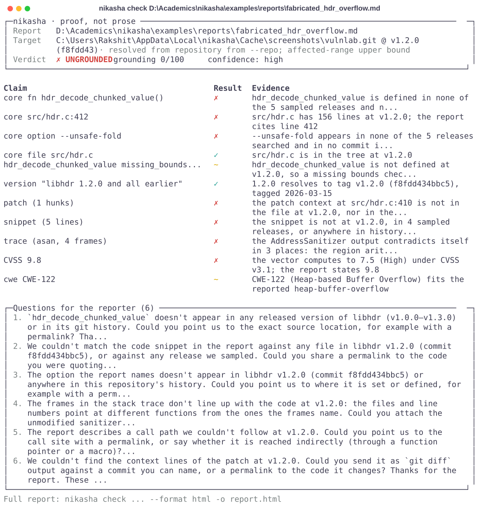
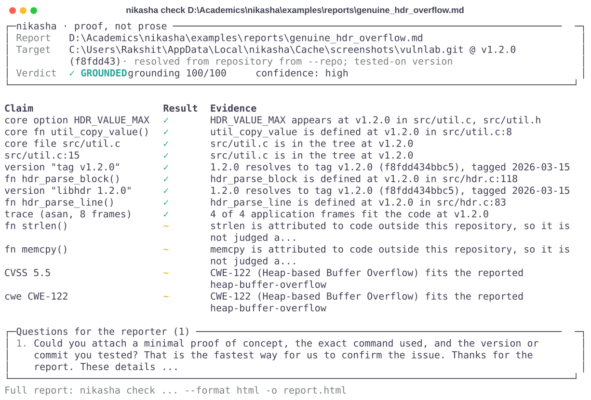
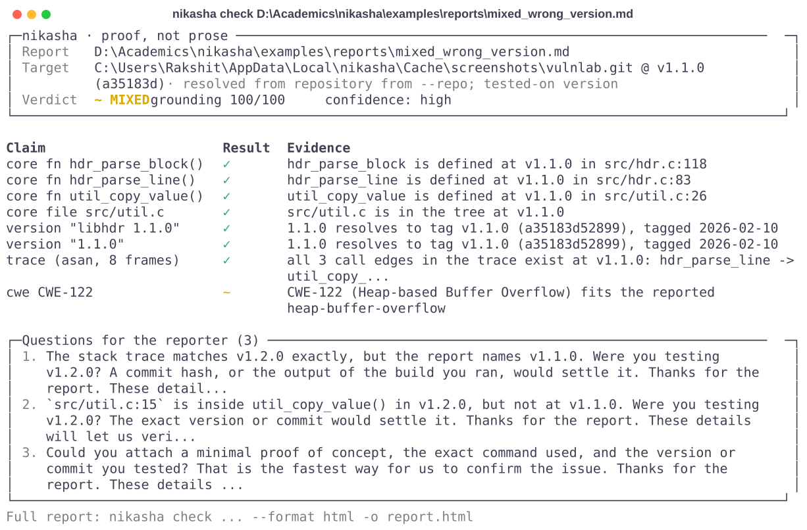
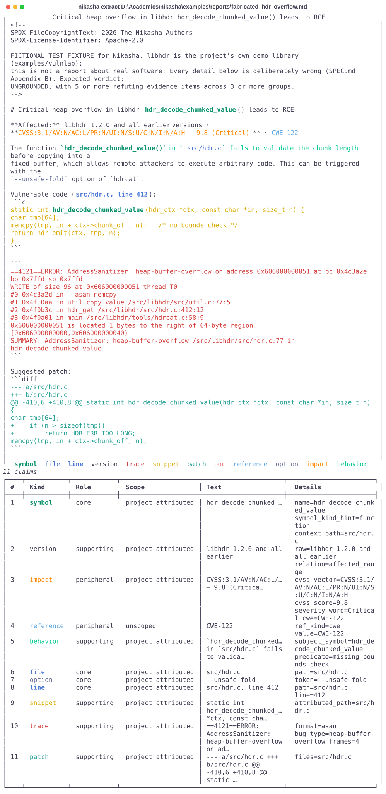
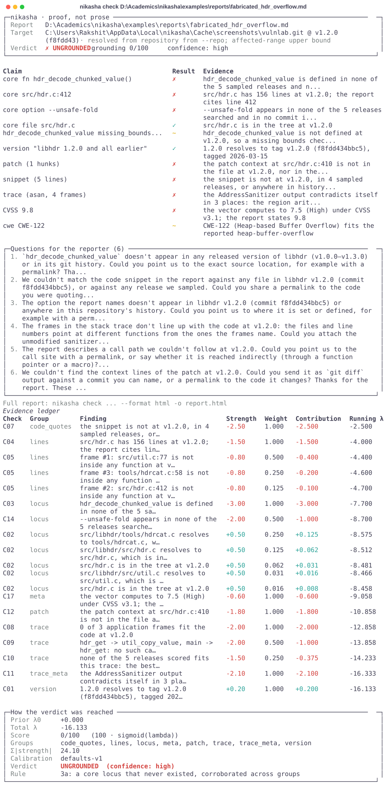

<!--
SPDX-FileCopyrightText: 2026 The Nikasha Authors
SPDX-License-Identifier: CC-BY-4.0
-->

# Nikasha

**Proof, not prose.**

Nikasha (निकष, *touchstone*: the stone used to assay gold) checks the factual claims in a
vulnerability report against the source code at the exact version the report names. It
runs offline against a git repository, is deterministic (the same report and the same
commit give byte-identical JSON, with no LLM involved), and returns an evidence-backed
verdict in which every finding carries the evidence behind it (the repository, commit, path
and lines where there is code, and the git command with output hashes where one was run),
plus neutral questions to send back to the reporter. It judges claims, never people: there
is no "AI detection" anywhere in it.

<picture>
  <source media="(prefers-color-scheme: dark)" srcset="docs/assets/terminal-check-ungrounded-dark.svg">
  
</picture>

> **Status: pre-release (`0.1.0.dev0`).** Everything shown on this page is a real run against
> the bundled **vulnlab demo** (a fictional C library with a deliberately introduced heap
> overflow), not against real reports. The early real-world gate (M3.5) has not run yet, so
> Nikasha has **no accuracy numbers on real reports**, and this page makes no such claim.

## The five verdicts

| Verdict | Meaning | Exit code |
|---|---|---|
| **REPRODUCED** | The proof of concept ran in the sandbox and produced the claimed crash signature. `nikasha check` has no `--repro` option yet, so a `check` run cannot reach this verdict today; the sandbox itself (`nikasha repro`, M5) is built but not yet verified in CI. | 0 |
| **GROUNDED** | A high grounding score and no substantial refutation anywhere. | 0 |
| **MIXED** | Evidence on both sides, or findings that fit a *different* version than the report names (a wrong version header is a question, never an accusation). | 10 |
| **UNGROUNDED** | The hardest verdict to reach: a low score *and* a core file, symbol, quoted line, snippet or option that never existed in the repository's history, corroborated by a second independent group of evidence (or strong refutations from three independent groups). | 20 |
| **INSUFFICIENT** | Too little to check: no resolvable version, fewer than two checkable claims with no trace, snippet, patch or PoC, or too little total evidence weight. | 30 |

Errors exit 1. `--fail-on VERDICT` moves the non-zero line for CI.

## Quickstart

You need Python 3.11 or newer and git. Install from a checkout with
[uv](https://docs.astral.sh/uv/) or pipx:

```sh
git clone https://github.com/rakshit-737/nikasha && cd nikasha
uv tool install .          # or: pipx install .   (or: uv sync && uv run nikasha ...)
nikasha doctor             # Python, git, cache directory, container engines; no network
```

Optional extras add the integrations: `web` (local web UI), `mcp` (MCP server), `llm`
(Anthropic and OpenAI clients for `--llm`) and `bench` (NikashaBench plots), for example
`uv tool install '.[web,mcp]'`.

Build the demo repository. `scripts/build_vulnlab.py` replays a fixed commit plan into a
new bare repository with `git fast-import`, so the five tags (`v1.0.0` to `v1.3.0`) land on
the same commit SHAs on every machine ([`examples/vulnlab/README.md`](examples/vulnlab/README.md)):

```sh
python scripts/build_vulnlab.py ~/vulnlab.git
```

Then check the fixture reports against it, entirely offline:

```sh
nikasha check examples/reports/fabricated_hdr_overflow.md --repo ~/vulnlab.git            # UNGROUNDED, exit 20
nikasha check examples/reports/genuine_hdr_overflow.md    --repo ~/vulnlab.git --explain  # GROUNDED, with the ledger
nikasha check examples/reports/mixed_wrong_version.md     --repo ~/vulnlab.git --format markdown -o reply.md
nikasha check examples/reports/genuine_hdr_overflow.md    --repo ~/vulnlab.git --format html -o report.html
nikasha check examples/reports/genuine_hdr_overflow.md    --repo ~/vulnlab.git --format json -o result.json
nikasha explain result.json
```

`--format` takes `terminal` (default), `json`, `markdown` or `html`. The Markdown reply
stays under GitHub's comment limit and escapes everything that came from the report or the
code. The HTML report is one self-contained file that makes no network request, enforced by
a Content-Security-Policy that pins its single inline script by hash, with light, dark and
print themes and a JSON download. `--explain` appends the log-odds ledger behind the score;
`nikasha explain` prints the ledger from a saved JSON result. `--quiet` prints only the
verdict line and `--ascii` avoids non-ASCII symbols on legacy consoles. A `https://`
repository is cloned only with `--online`; a local path never touches the network.

<details>
<summary>The other two demo fixtures: GROUNDED and MIXED</summary>

<picture>
  <source media="(prefers-color-scheme: dark)" srcset="docs/assets/terminal-check-grounded-dark.svg">
  
</picture>

<picture>
  <source media="(prefers-color-scheme: dark)" srcset="docs/assets/terminal-check-mixed-dark.svg">
  
</picture>
</details>

<details>
<summary><code>nikasha extract</code>: every claim the report makes, before any check runs</summary>

<picture>
  <source media="(prefers-color-scheme: dark)" srcset="docs/assets/terminal-extract-dark.svg">
  
</picture>
</details>

Other commands: `nikasha extract` (the claims, with `--json`), `nikasha index`,
`nikasha timeline SYMBOL` (in which releases a symbol is defined, with "did you mean"
suggestions), `nikasha trace` (a stack trace against the code), `nikasha lint` (check a
draft report before submitting it, no verdict), `nikasha cve` (a CVE JSON 5.x record),
`nikasha repro` and `nikasha recipes` (sandboxed reproduction), `nikasha bench`,
`nikasha mcp`, `nikasha serve` (local web UI), and the read-only fetchers `nikasha h1` and
`nikasha gh-advisories`. `nikasha --help` lists them all.

## What it checks

The pipeline is ingest → extract → resolve → code intelligence → checks → fusion → render
([ADR 0001](docs/adr/0001-architecture.md)). Intake reads Markdown, text and HTML with an
exact map back to the source; extraction produces 12 claim kinds; resolution pins the
report to a tag or commit and never guesses silently; tree-sitter parses C, C++, Python,
JavaScript, TypeScript/TSX, Go, Rust, Java, PHP and Ruby; and nine trace formats are parsed
(ASan, UBSan, valgrind, gdb, Python, Java, Go, Rust, Node), each tested against real
captured output. The 19 deterministic checks, C01 to C18 and C21, are catalogued with their
strengths in [`docs/checks.md`](docs/checks.md), generated from the code:

| Group | Checks | The question each answers about the code at the resolved commit |
|---|---|---|
| version | C01, C16 | Does the named version resolve to a tag or commit? Does the claimed affected range fit the core symbol's timeline across releases? |
| locus | C02, C03, C14 | Do the cited file, symbol and option exist here, and if not, did they ever exist in the history? |
| lines | C04, C05 | Is the line number inside the file, and inside the function it is said to be in? |
| code quotes | C06, C07 | Does the quoted line match the file? Where does the quoted snippet come from (winnowing fingerprints)? |
| trace | C08, C09, C10 | Do the frames fit the code, can each caller reach each callee in the call graph, and which release fits the trace best? |
| trace meta | C11 | Is the sanitizer output consistent with itself: PIDs, frame numbering, addresses, region arithmetic, SUMMARY line, access size? |
| patch | C12 | Does the proposed diff apply at this commit, or was it already applied? |
| refs, meta, behavior | C15, C17, C18 | Do cited commits, links, CVE and CWE records check out? Does the CVSS vector recompute to the stated score? Does the named function really call the API? |
| info | C13, C21 | Which later commits touch the reported locus? What is the report missing (version, PoC, trace, location)? |

Two more checks sit outside that count. **C19** (reproduction) scores a sandboxed PoC run
and produces nothing without one; `nikasha check` does not start the sandbox yet. **C20** (`LLM_REVIEW`) is on disk but inert unless you name a model
with `--llm` or in `nikasha.toml`: it may only tilt a score, because its strength is capped
at |0.5| in `lr_defaults.yaml`, below every verdict threshold, and a model that cannot be
reached yields an error at strength 0, never a refutation.

## How the verdict is computed

Every check emits evidence with a natural-log likelihood ratio taken from
[`lr_defaults.yaml`](src/nikasha/checks/lr_defaults.yaml) (no float literal is ever used as a strength),
and within each evidence group the findings are ranked by strength and weighted 1, ½, ¼, …,
so ten correlated findings cannot outweigh a few independent ones; the damped sum is the
log-odds behind the 0–100 grounding score. An ordered verdict ladder (SPEC §14.3,
[`fuse/verdict.py`](src/nikasha/fuse/verdict.py)) then decides, first match wins: a
reproduced crash; too little to check; UNGROUNDED only for a low score plus a
never-existed refutation corroborated across groups; a version mismatch capped at MIXED;
GROUNDED for a high score with no substantial refutation; otherwise MIXED or INSUFFICIENT.
Before any of that, the refutation gate of [ADR 0003](docs/adr/0003-differentiation-vs-slopcheck.md)
lets only claims the reporter attributed to the project, and did not negate, be refuted at
all: a finding about the reporter's own PoC code or a third-party API is still shown, with
the strength it would have had, but counts for nothing.

<picture>
  <source media="(prefers-color-scheme: dark)" srcset="docs/assets/terminal-explain-dark.svg">
  
</picture>

## Principles

1. **Evidence, not AI detection.** Wording targets claims, never people.
2. **Deterministic core.** Byte-identical JSON for identical inputs; the LLM is optional,
   off by default and never decisive.
3. **Confidential by default.** Offline unless `--online`, no telemetry, cloud models only
   with `llm.allow_cloud = true` in a config file.
4. **Conservative about "fabricated".** The target is at most 1% false UNGROUNDED on genuine
   reports; when in doubt, MIXED or INSUFFICIENT, and ask.
5. **PoCs are hostile.** They run only in the sandbox, never on the host.
6. **Every line is explainable** down to a repository, commit, path, lines and command.
7. **Input is an attack.** Report text, repositories and traces are treated as hostile
   (XSS, ReDoS, path traversal, git config tricks, prompt injection).
8. **Useful to reporters too** (`nikasha lint`).

When principles conflict, safety wins: P4 first, then P5, then P3.

## Where this stands

A static "does this function exist?" check alone is not enough.
[slopcheck](https://github.com/GaganGanesh98/SlopCheck) measured six static existence checks
(file, line range, symbol, snippet, commit and tagged version) on 557 publicly disclosed curl
reports, every one scored against HEAD rather than the version it named, and published a
careful negative result: the checks flagged confirmed, genuine reports about as often as the
reports they were meant to catch. Nikasha treats that as the baseline to beat and targets its
measured failure modes (version pinning, claim scoping, negation, line binding, structural
trace and patch checks), but **whether that is enough is an open question until the M3.5 gate
runs**. Its results will be published whatever they are, and thresholds are never adjusted to
pass it.

| Milestone | Status |
|---|---|
| M0 Bootstrap · M1 Models, intake, extraction · M2 Resolution and code intelligence · M3 Checks, fusion, CLI outputs · M4 HTML report | **done** (measurements in [`PROGRESS.md`](PROGRESS.md) and [ADR 0004](docs/adr/0004-timeline.md)) |
| M3.5 Early real-world gate (curl corpus vs. slopcheck) | **not started**: needs network access and a check of HackerOne's terms for the disclosed-report endpoint before any report is fetched |
| M5 Sandbox reproduction | **built, not done**: done when the sandbox workflow is green in CI with the real recipe image |
| M6 NikashaBench and calibration | **machinery done**; the real-report splits wait on M3.5 corpus access |
| M7 Integrations | **done** (a GitHub Action, `nikasha lint`, the MCP server, the web UI, the optional model layer; network paths tested with stubs only) |
| M8 Launch polish and v0.1.0 | **tooling done, not published**: a release is a public, irreversible action that waits for the maintainer's approval |
| M9 Stretch | not started |

## More

- [`CONTRIBUTING.md`](CONTRIBUTING.md): setup, standards, and the guides for adding a
  check, a trace format, a reproduction recipe or a language.
- [`SECURITY.md`](SECURITY.md): private reporting and what is in scope. [`SUPPORT.md`](SUPPORT.md) for help.
- [`docs/checks.md`](docs/checks.md): the checks catalogue. [`docs/action.md`](docs/action.md): the GitHub Action.
- [`docs/adr/`](docs/adr/): the decisions, including the
  [rename](docs/adr/0000-rename.md) ([`SPEC.md`](SPEC.md) still says "Pramaan"),
  [dependencies](docs/adr/0002-dependencies.md),
  [repository access](docs/adr/0006-repository-access.md) and the
  [fusion decisions](docs/adr/0007-fusion-decisions.md).
- [`PROGRESS.md`](PROGRESS.md) and [`CHANGELOG.md`](CHANGELOG.md): what is done, with numbers.

## License

Code is licensed under [Apache-2.0](LICENSE); documentation under
[CC-BY-4.0](LICENSES/CC-BY-4.0.txt). See [`REUSE.toml`](REUSE.toml) for per-file details.
