# Pramaan: Build Specification

> **Pramaan** (प्रमाण, Sanskrit/Hindi for *proof* or *a valid means of knowledge*) is an open-source tool that **checks the factual claims in a vulnerability report against the real source code at the exact version the report names.** It tells a maintainer, in seconds and with evidence, whether a report is **reproduced, grounded, mixed, ungrounded (likely hallucinated) or too vague to check**. It also drafts precise follow-up questions for the reporter.
>
> Tagline: **Proof, not prose.**
>
> Spec version 1.0, written 2026-09-22. This file is the single source of truth for building the project with Claude Code.

---

## How Claude Code must use this document

1. **Read the whole spec before planning.** Then produce a plan in plan mode that maps onto the milestones in §22. Don't start coding until the user approves the plan.
2. The keywords **MUST, MUST NOT, SHOULD and MAY** follow RFC 2119. A MUST is part of the definition of done.
3. **Never invent external facts, APIs, CLI flags or file formats.** Every library API, GitHub feature and data-source format mentioned here must be checked against current official docs before you use it. Appendix A lists the starting URLs. If the docs disagree with this spec, follow the docs, record the difference in `docs/adr/`, and tell the user.
4. **Keep project memory for future sessions:**
   - Create `CLAUDE.md` in M0 (content in §24.3).
   - Keep `PROGRESS.md` up to date with what's done, what's next and any open questions.
   - Update `CHANGELOG.md` at every milestone.
   - This project spans many sessions, so a new session must be able to resume from those files alone.
5. Ask the user before any irreversible or public action: creating the GitHub repo, changing repo visibility, publishing to PyPI or GHCR, creating releases, or changing security settings.
6. Honesty rule: **if a target in this spec isn't met, report the real numbers.** Never weaken a test, a benchmark or a claim to make it pass.

---

## 0. Mission, problem and evidence

### 0.1 The problem (context for the README; re-verify every number before publishing it)

Vulnerability reporting is being flooded with AI-generated "slop": reports and even CVE records that describe functions, files, line numbers, stack traces and patches that don't exist. They cost maintainers hours each to disprove. At the same time, AI tools are finding *real* bugs at higher volume. Maintainers need to **reject fabricated reports cheaply and confirm real ones quickly.**

Facts gathered on 2026-09-22 (sources in Appendix A.1):

- **curl ended its bug bounty.** Daniel Stenberg announced the end of the program on 2026-01-26, effective 2026-01-31, citing AI slop. The share of confirmed reports fell below 5% in 2025, down from more than 15% before. curl keeps a public list of AI-slop reports submitted to the project: a GitHub gist with about 49 entries, each linking to a HackerOne report.
- **JFrog (2026-07-30) found 54 of 55 advisories from one GitHub account were fabricated.** They included two SQLite CVEs rated CVSS 9.8 (CVE-2026-51302 and CVE-2026-51303). JFrog checked them *by hand*: the cited functions didn't exist in the claimed versions, and they re-ran the PoCs under ASan.
- **The Register (2026-08-03)** reported that MITRE rejected the whole set. It quotes JFrog: *"no step in today's system actually requires a proof-of-concept or bug reproduction."*
- **An academic survey (arXiv 2608.25667, UNSW, 2026-08-26)** on AI slop and hallucinations in vulnerability assessment found that *"not a single study provides execution-level validation of claims in LLM outputs."* It lists no existing tool that detects or verifies slop reports.
- **Alpha-Omega's guidance for AI-assisted bug finders (2026-04-30)** tells *reporters* to "verify file paths, function names, line numbers and affected versions against the real source". It names no tool that does this.
- **The Linux Foundation, via Alpha-Omega and OpenSSF (2026-03-17),** put $12.5M toward helping maintainers cope with AI-generated reports.
- **Bug bounty platforms report record volume.** HackerOne says submissions are up more than 100% since February 2026. Bugcrowd says its queues rose 334% in three weeks. (These figures come from vendor marketing pages; treat them as lower confidence.)

### 0.2 Prior art and positioning (re-verify in M0 and before launch)

| Tool | Audience | Open source | How it works | What Pramaan adds |
|---|---|---|---|---|
| **Scrutineer** (Alpha-Omega) | Bug *finders* | Yes (MIT) | AI scanning and disclosure pipeline. Its `revalidate`/`verify` commands use an LLM to judge findings against the **latest** code, in sandboxed containers with ASan/UBSan images. | Built for maintainers. **Version-pinned, deterministic** checks of the claims. Symbol timelines, stack-trace and call-graph forensics, crash-signature matching, drafted questions for the reporter. Pramaan could also sit *downstream* of Scrutineer. |
| **AnyPoC** (UIUC, arXiv 2604.11950) | Research | No code found | An agent fact-checks and generates PoCs for its *own* bug finder's candidate reports. | A deterministic, version-pinned product aimed at maintainers. |
| **HackerOne Hai / H1 Validation** | HackerOne customers | Closed | Deduplication, triage, "live reproduction". | Open source, local-first, works with any intake (email, GitHub, HackerOne, CVE JSON), checks claims against the source. |
| **CVE-Genie** (arXiv 2509.01835) and SEC-bench / CyberGym / ARVO | Research benchmarks | Partly | Reproduce CVEs they assume are real. | A failed reproduction isn't a verdict. Pramaan explains *which claims* are false, and why. |
| GitHub Security Lab **Taskflow Agent** | CodeQL alert triage | Yes (MIT) | Triages static-analysis alerts. | Triages incoming human or AI *reports*. |

The white space: **no open-source, maintainer-facing tool mechanically verifies a report's factual claims against the code at the claimed version.** That is Pramaan's reason to exist. If M0's re-check finds a new direct competitor, stop and tell the user, with a proposed way to differentiate.

### 0.3 Mission statement
Make fabricated vulnerability reports **cheap to reject** and real ones **fast to confirm**, using evidence anyone can re-run rather than guesswork.

---

## 1. Product principles (non-negotiable)

- **P1. Evidence, not "AI detection".** Pramaan MUST NOT classify prose as "AI-written". Plenty of honest reporters use AI to polish their writing. Pramaan checks **claims against code**. Wording is aimed at claims ("function `x` does not exist at tag `y`"), never at people.
- **P2. Deterministic core.** Every verdict MUST be reproducible **without any LLM**, with identical inputs producing byte-identical JSON (excluding timings). LLM assistance is optional, off by default, and never decisive on its own (§16.6).
- **P3. Confidential by default.** Reports may be under embargo.
  - Pramaan MUST work fully offline.
  - It MUST make no network calls unless `--online` is passed, and MUST have no telemetry.
  - It MUST refuse to use a cloud LLM unless the user explicitly opts in (`llm.allow_cloud = true` plus a printed warning).
  - Docs MUST warn never to run Pramaan on private reports in public CI, because GitHub Actions logs on public repos are public.
- **P4. Conservative about "fabricated".** Wrongly labelling a genuine report UNGROUNDED is the worst possible error. Thresholds MUST be tuned so this happens on ≤1% of genuine reports in PramaanBench (target 0). When in doubt, say MIXED or INSUFFICIENT and ask a question.
- **P5. PoCs are hostile code.** Proof-of-concept code runs **only** inside a hardened, network-less container, **only** when opted in (`--repro`), and **never** on the host (§13).
- **P6. Every line is explainable.** Every verdict and question links to evidence items that carry their provenance: repo, ref, commit, path, line span, and the exact command with hashes of its output.
- **P7. Treat the input as an attack.** Report text, attachments and repos are attacker-controlled. Pramaan hardens itself against:
  - XSS in HTML output;
  - ReDoS and oversized inputs;
  - path traversal in attachments;
  - git config and hook tricks;
  - prompt injection against the optional LLM.

  See §19.
- **P8. Useful to both sides.** The same engine powers `pramaan lint` for honest reporters, so hallucinated details get caught before a report is submitted.

---

## 2. Users and jobs to be done

| Persona | Job | Entry point |
|---|---|---|
| Open-source maintainer | "Is this report real? What should I ask the reporter?" | `pramaan check report.md`, the GitHub Action, the MCP server |
| PSIRT or bug-bounty triager | Clear the queue quickly; confirm real bugs | `pramaan check`, `pramaan h1 <id>`, batch mode |
| CVE consumer (distro security team, scanner vendor) | "Does this CVE record describe code that exists?" | `pramaan cve CVE-2026-XXXXX` |
| Honest bug hunter | "Did my AI assistant hallucinate anything in my report?" | `pramaan lint draft.md --repo … --version …` |
| Researcher | Measure how well report-validation methods work | PramaanBench (§17) |

---

## 3. Scope

**v0.1.0 (MUST):**
- Deterministic claim extraction (§9).
- Target resolution (§10).
- Code intelligence for C and C++ (first class), plus symbol-level support for Python, JavaScript, TypeScript, Go, Rust, Java, PHP and Ruby (§11).
- Checks C01–C19 and C21 (§12). C20 (optional LLM review) SHOULD also be in v0.1.0.
- Evidence fusion, verdicts and questions (§14).
- Terminal, Markdown, JSON and HTML outputs (§15).
- Sandbox reproduction with 3 or more recipes (§13).
- PramaanBench v1 with published results (§17).
- GitHub Action, MCP server, `lint` mode, local web UI, HackerOne, GitHub-advisory and email intake (§16).
- A fully polished GitHub repo, with screenshots and a demo GIF generated from real runs (§21).

**Later (SHOULD/MAY; roadmap):**
- CVE Observatory (§18).
- Draft VEX statements (OpenVEX) for CVE consumers.
- A sidecar-server PoC kind (e.g. a malicious HTTP server for client bugs).
- More recipes and languages.
- An arXiv paper on PramaanBench.

**Out of scope:** closed-source targets (the verdict is INSUFFICIENT, with the reason "no source available"); judging whether a *real* bug is exploitable or how severe it is, beyond consistency checks; any automatic public accusation.

---

## 4. System overview

```mermaid
flowchart LR
  A[Report intake<br/>md/txt/html/eml, HackerOne, GitHub advisory, CVE JSON] --> B[Normalize<br/>offset-preserving text + code blocks]
  B --> C[Claim extraction<br/>deterministic parsers, optional LLM with quote validation]
  C --> D[Target resolution<br/>repo, version→tag/commit]
  D --> E[Code intelligence at ref<br/>tree-sitter symbols, calls, git grep, fingerprints, symbol timeline]
  C --> F[Checks C01–C21]
  E --> F
  F --> G{--repro?}
  G -- yes --> H[Sandbox build + PoC run<br/>podman/docker, ASan/UBSan]
  H --> I[Signature match C19]
  G -- no --> J[Evidence ledger]
  I --> J
  J --> K[Fusion: log-odds with group damping]
  K --> L[Verdict + questions]
  L --> M[Renderers: terminal, Markdown, JSON, HTML]
  L --> N[Integrations: GitHub Action, MCP, web UI]
```



The pipeline is **pure and staged**. Each stage takes typed input and produces typed output (pydantic models), so every stage can be cached, tested and replayed on its own.

---

## 5. Tech stack and dependency policy

- **Python ≥ 3.11.** Test every currently supported CPython release from 3.11 up that all dependencies support. Use a `src/` layout with the **hatchling** build backend. Use **uv** for environments and lockfiles (`uv.lock` committed).
- **Core runtime dependencies** (keep the list small and justify each one in `docs/adr/0002-dependencies.md`):
  - `typer` and `rich`: CLI and terminal UI, including SVG export for screenshots.
  - `pydantic` v2: models and JSON Schema generation.
  - `platformdirs`: cache and config locations.
  - `tree-sitter` (py-tree-sitter ≥ 0.25) plus **per-language grammar wheels**: `tree-sitter-c`, `-cpp`, `-python`, `-javascript`, `-typescript`, `-go`, `-rust`, `-java`, `-php`, `-ruby`.
    - Do **not** use `tree-sitter-language-pack` ≥ 1.0. It reportedly downloads grammars at runtime, which breaks P3's offline guarantee. Verify this, and record the decision in an ADR.
    - Verify the current `Query`/`QueryCursor` API; `Language.query()` was removed.
  - `markdown-it-py`: parse Markdown and find code fences with line maps.
  - `unidiff`: parse patches.
  - `rapidfuzz`: fast edit-distance primitives. The BK-tree itself is our own code.
  - `pygments`: syntax highlighting pre-rendered into the HTML report.
  - `jinja2`: HTML and Markdown templates, with autoescape on.
  - `cvss`: parse CVSS v3/v4 vectors and compute scores. Verify that v4 is supported.
  - `httpx`: only used in `--online` mode.
- **Optional extras:**
  - `[web]`: `fastapi`, `uvicorn`.
  - `[mcp]`: the official `mcp` Python SDK.
  - `[llm]`: `anthropic`, `openai`, and Ollama over plain HTTP.
  - `[bench]`: `matplotlib` for charts; alternatively, emit hand-written SVG.
  - `[dev]`: `pytest`, `pytest-cov`, `hypothesis`, `pytest-benchmark`, `mypy`, `ruff`, `playwright`, `pip-licenses`, `cyclonedx-bom`, `reuse`, `codespell`, `pre-commit`.
- **Git access:** use the `git` CLI through a single hardened wrapper (§19.3) and **plumbing** commands: `ls-tree`, `cat-file --batch`, `grep <tree>`, `rev-list`, `log -S`, `tag`. Never check out attacker-controlled working trees unless it's unavoidable. No libgit2 dependency.
- **Containers:** call the `podman` or `docker` CLI through `subprocess` (no SDK). Podman is the default on Fedora and is preferred when present.
- **Storage:** stdlib `sqlite3` in WAL mode for caches.
- **Typing and linting:** `mypy --strict` on `src/`; `ruff check` and `ruff format`.

---

## 6. Repository layout

```
pramaan/
├── README.md                      # see §21.4
├── LICENSE                        # Apache-2.0 (code)
├── NOTICE
├── LICENSES/                      # REUSE: Apache-2.0.txt, CC-BY-4.0.txt, CC-BY-SA-4.0.txt (CoC), CC0-1.0.txt
├── REUSE.toml
├── THIRD_PARTY_NOTICES.md         # generated (pip-licenses) for the Docker image & docs
├── CITATION.cff
├── CODE_OF_CONDUCT.md             # Contributor Covenant 3.0 (CC BY-SA 4.0)
├── CONTRIBUTING.md
├── SECURITY.md
├── SUPPORT.md
├── GOVERNANCE.md
├── CHANGELOG.md                   # Keep a Changelog + SemVer
├── CLAUDE.md                      # project memory for Claude Code (§24.3)
├── PROGRESS.md                    # living build log
├── pyproject.toml  uv.lock  .python-version
├── Makefile                       # setup lint type test test-all bench docs screenshots demo release-check
├── Dockerfile                     # CLI image (non-root) for the GitHub Action & GHCR
├── action.yml                     # GitHub Action
├── src/pramaan/
│   ├── __init__.py  __main__.py  cli.py  config.py  errors.py  version.py
│   ├── model/        report.py claims.py evidence.py verdict.py result.py ids.py
│   ├── ingest/       text.py markdown.py html.py email.py hackerone.py gh_advisory.py cve_json.py osv.py attachments.py
│   ├── extract/      spans.py versions.py symbols.py paths.py lines.py snippets.py patches.py
│   │                 commands.py references.py options.py impact.py behavior.py llm_assist.py
│   │   └── traces/   asan.py ubsan.py lsan.py msan.py tsan.py valgrind.py gdb.py
│   │                 python_tb.py java.py go_panic.py rust_panic.py node.py common.py
│   ├── resolve/      repo.py refs.py products.py dates.py
│   ├── code/         gitio.py languages.py parser.py symbols.py calls.py macros.py index.py
│   │                 timeline.py fingerprint.py bktree.py pathtrie.py literal.py
│   ├── checks/       base.py registry.py c01_version.py … c20_hygiene.py
│   ├── repro/        sandbox.py recipes.py builder.py poc.py signature.py
│   ├── fuse/         lr_defaults.yaml scoring.py calibrate.py verdict.py questions.py
│   ├── render/       terminal.py markdown.py json_out.py html.py svg.py
│   │   └── templates/ report.html.j2 comment.md.j2 partials/…
│   ├── integrations/ action_entry.py mcp_server.py web/app.py web/templates/…
│   ├── llm/          base.py ollama.py anthropic.py openai.py guard.py
│   └── bench/        manifest.py fetch.py mutate.py run.py metrics.py report.py
├── recipes/                       # YAML build/run recipes (vulnlab, curl, sqlite, libxml2 …)
├── docker/recipes/*.Dockerfile    # toolchain images per recipe
├── schema/                        # generated JSON Schemas (result-v1.json, recipe-v1.json)
├── known_projects.yaml            # product aliases → repo URL, tag pattern, recipe
├── examples/
│   ├── vulnlab/                   # built by scripts (not committed as a nested .git; see §20.2)
│   └── reports/                   # genuine / fabricated / mixed / vague / already-fixed fixtures
├── bench/                         # manifests (IDs+labels only), DATASET_CARD.md, RESULTS.md, charts/
├── docs/                          # docs site source + assets/ (screenshots, gif, logo, social preview) + adr/
├── scripts/                       # build_vulnlab.py make_screenshots.py make_social_preview.py gen_checks_doc.py gen_schema.py
├── tests/                         # unit/ integration/ security/ golden/ fixtures/
└── .github/                       # workflows, issue forms, templates (§21.2)
```

---

## 7. Data model (`src/pramaan/model/`)

All models are pydantic v2 with `model_config = ConfigDict(frozen=True, extra="forbid")`. IDs are stable: `sha256(kind + canonical fields)[:12]`, so IDs are identical across runs.

- **Report**
  - `id`, `source` (`kind`: text | markdown | html | eml | hackerone | gh_advisory | cve_json; plus `uri`), `title`.
  - `body`: normalized text, plus a `SourceMap` from normalized offsets back to original offsets.
  - `code_blocks`: `CodeBlock(span, lang_hint, content, role_guess)`.
  - `attachments`: `Attachment(name_sanitized, sha256, size, media_type, stored_path)`.
  - `reported_at` (optional), `declared_target` (product, repo URL, versions) when intake metadata provides it.
  - The reporter's identity is **not** stored.
- **Span**: `start`, `end` (offsets into `body`) and `text`, with an invariant that `body[start:end] == text`.
- **Claim**: a tagged union keyed by `kind`. Every claim has `id`, `spans`, `extractor` (`"deterministic:<name>"` or `"llm:<provider>/<model>"`), `confidence` and `role` (`core` | `supporting` | `peripheral`).
  - `VersionClaim`: `product`, `raw`, `parsed: VersionSpec`, `relation` (tested_on | affected_range | fixed_in | latest).
  - `SymbolClaim`: `name`, `symbol_kind_hint` (function | macro | type | field | method | class | constant | unknown), `lang_hint`, `context_path`.
  - `FileClaim`: `path`.
  - `LineClaim`: `path`, `line`, `col`, `function_hint`, `quoted_line`.
  - `TraceClaim`:
    - `format` (asan | ubsan | lsan | msan | tsan | valgrind | gdb | python | java | go | rust | node), `bug_type`, `access` (READ/WRITE, size), `address`.
    - `region` (start, end, size, relation, distance).
    - `frames: list[Frame]`, where each frame is `index`, `function`, `path`, `line`, `col`, `module`, `is_runtime`.
    - `alloc_frames`, `free_frames`, `summary`, `pid`, `thread`.
  - `SnippetClaim`: `code`, `lang_hint`, `attributed_path`, `attributed_function`.
  - `PatchClaim`: `diff`, `files`, `hunks`.
  - `PocClaim`: `kind` (cli | file_input | c_harness | python | shell | libfuzzer_input | http_sidecar), `content` or `attachment_ref`, `entry`.
  - `ReferenceClaim`: `ref_kind` (url | commit | cve | cwe | ghsa | issue | pr), `value`.
  - `OptionClaim`: `token` (e.g. `--foo-bar`, `CURLOPT_FOO`, `config.key`).
  - `ImpactClaim`: `cvss_vector`, `cvss_score`, `severity_word`, `cwe`.
  - `BehaviorClaim`: `subject_symbol`, `predicate` (calls_api | missing_bounds_check | missing_null_check | uses_freed | integer_overflow | …), `object` (e.g. `memcpy`).
- **Evidence**
  - `id`, `check_id`, `claim_ids`, `outcome` (SUPPORTS | REFUTES | NEUTRAL | ERROR), `strength` (a log likelihood ratio, as a float), `group`, `summary` (one human sentence), `details` (structured).
  - `locations: list[CodeLocation]`, where each location has `repo`, `ref`, `commit`, `path`, `start_line`, `end_line`, `excerpt` and `permalink`.
  - `commands: list[CommandRecord]`, each with `argv`, `exit_code`, `stdout_sha256`, `stderr_sha256`, `duration_ms` and `truncated`.
  - `produced_by` (deterministic | llm).
- **Verdict**
  - `label`: REPRODUCED | GROUNDED | MIXED | UNGROUNDED | INSUFFICIENT | ERROR.
  - `score`: 0–100 grounding score. `confidence`: low | medium | high.
  - `key_evidence` (ordered IDs), `questions: list[Question(text, rationale, evidence_ids)]`, `notes`.
- **Result** (top-level JSON)
  - `schema` (a URL to `result-v1.json`), `tool_version`, `report`, `claims`, `target: ResolvedTarget`, `evidence`, `verdict`, `timings`, `environment` (offline or online, sandbox engine, llm).
  - Serialize with sorted keys and stable ordering.

Generate `schema/result-v1.json` from the models (`scripts/gen_schema.py`). CI fails if the committed schema drifts from the models.

---

## 8. Ingestion (`src/pramaan/ingest/`)

- **Input:** a file path, `-` for stdin, or an intake command (`h1`, `gh-advisories`, `cve`).
  - Format is auto-detected from the extension or content; `--input-format` overrides it.
  - Every ingester returns a `Report` whose `SourceMap` is correct.
- **Markdown** (`markdown-it-py`): keep fenced code blocks **verbatim**, and inline code spans with their backticks, since these are strong extractor hints. Record the fence info string as `lang_hint`.
- **HTML:** use the stdlib `html.parser` to produce text. Keep `<pre>`/`<code>` content verbatim. Drop `<script>`/`<style>`. Never render or execute anything.
- **Email** (`.eml`/`.mbox`): stdlib `email` with `policy=default`.
  - Use text/plain if present; otherwise send text/html through the HTML path.
  - Attachments go through the attachment handler.
  - `git format-patch` emails are recognised as patches.
- **HackerOne:**
  - **Program owners** use the documented API: `GET https://api.hackerone.com/v1/reports/{id}` with HTTP Basic auth (API identifier and token from env vars; verify the documented names). It gives the title, `vulnerability_information`, weakness, severity, and attachments via `expiring_url`.
  - **Public disclosed reports** (bench only, `--online`): the undocumented `https://hackerone.com/reports/{id}.json`. It's best-effort and rate-limited. Check HackerOne's terms first; if they're unclear, let the user supply the files by hand.
- **GitHub private vulnerability reports:** `GET /repos/{owner}/{repo}/security-advisories?state=triage`, with a token from `GH_TOKEN` or `gh auth token`.
  - Process results **locally only**.
  - There is no comment endpoint, and Pramaan MUST NOT post private content anywhere.
- **CVE JSON 5.x:**
  - Parse `containers.cna.descriptions`, `affected[]` (vendor, product, `versions[]` with version, lessThan, lessThanOrEqual and status, plus `repo` when present), `references[]`, `problemTypes` (CWE) and `metrics` (CVSS v3.x / v4.0).
  - Online fetch uses the cvelistV5 raw path `cves/{year}/{floor(num/1000)}xxx/CVE-{year}-{num}.json`.
  - Handle REJECTED records.
- **OSV** (online): `POST https://api.osv.dev/v1/query` and `GET /v1/vulns/{id}`, for introduced/fixed commits and ranges.
  - curl's feed `https://curl.se/docs/vuln.json` is OSV (schema 1.5.0). Its `database_specific.issue` field holds the HackerOne report URL.
- **Attachments:**
  - Store them in a per-run temp dir (mode 0700).
  - Sanitize filenames: basename only, `[A-Za-z0-9._-]`, at most 100 characters, de-duplicated.
  - Default size caps: 10 MB per file, 50 MB in total.
  - **Archives are not extracted** by default. `--extract-archives` enables safe extraction: no absolute paths or `..`, no symlinks or hardlinks, at most 1,000 files, a compression ratio of at most 100:1, and at most 200 MB in total.
- **Limits:** the normalized body is capped at 2 MB (configurable). Truncate beyond that and add a visible warning to the result.

---

## 9. Claim extraction (`src/pramaan/extract/`)

**General rules:**
- Each extractor is a pure function `(Report) -> list[Claim]`, registered in a registry.
- Every claim keeps exact spans.
- Overlapping claims are de-duplicated (the more specific kind wins, and spans are merged).
- Regexes MUST run in linear time: no nested or ambiguous quantifiers over overlapping classes. Each regex has a hypothesis test that feeds adversarial strings with a time budget.

### 9.1 Code-block roles
Classify each block as `trace`, `patch`, `poc`, `snippet` or `log`:
1. Use the fence info string first (`diff`, `console`, `shell`, `c` and so on).
2. Then content signatures:
   - sanitizer or traceback headers → trace;
   - `diff --git`, `---/+++` and `@@` → patch;
   - shebangs, `int main(`, command prompts (`$ `), `curl …`, raw HTTP request lines, or "PoC/reproduce" in the nearest heading → poc;
   - otherwise snippet.

### 9.2 Versions
- Recognise:
  - `<product> <version>`, `version X`, `vX`;
  - bare `X.Y.Z` near cue words (version, release, tested, affected, before, prior to, up to, through, since, fixed in, <=, <, >=);
  - ranges (`from 7.69.0 to 8.3.0`, `>= 1.2, < 1.3`, `all versions before 3.45.1`);
  - `latest`, `master`, `main`, `HEAD`, `trunk`;
  - dates (`as of 2026-05-02`);
  - commit SHAs of 7–40 hex characters, **only in context**: `commit`, `rev`, `sha`, or a GitHub/GitLab URL. Never treat `0x…` values or sanitizer addresses as SHAs.
- Map product names through the aliases in `known_projects.yaml`.
- `VersionSpec` is a numeric tuple, an optional qualifier (rc/beta/alpha/letter suffix), and the raw text.

### 9.3 Symbols
**Candidates come from:**
- inline code spans;
- `identifier(` in prose;
- phrases such as "the function X", "in X()" or "X macro";
- definitions inside snippets (these are also used for provenance).

**Filtering:**
- The name must match the language family's identifier grammar.
- It must be at least 3 characters and not in an English stoplist.
- Names in bundled **external API lists** (libc/POSIX, pthread, a Win32 subset, common OpenSSL, zlib and libstdc++ names) are marked `external`. They're kept for context, but checks treat them as NEUTRAL.

**Role:** `core` if the symbol appears in the title or first paragraph, is tied to words like vulnerable/overflow/bug/crash, or is the top app frame. Otherwise it is `supporting`.

### 9.4 Paths, lines and permalinks
- Recognise:
  - `dir/file.ext`;
  - `file.ext:123[:45]`;
  - "line 123 of file.c" and "file.c (line 123)";
  - `L123`;
  - code blocks that carry line-number prefixes (`123 |`, `123:`), which become `LineClaim.quoted_line`;
  - **GitHub/GitLab blob URLs** with `#L10-L20`, from which we extract repo, ref (branch/tag/SHA), path and lines.
- Blob URLs are high value because they pin a commit.

### 9.5 Traces (one parser per format, all sharing a common `Frame` normalizer)
Required formats:
- ASan (including the allocated / freed / previously-allocated stacks, region lines and SUMMARY)
- UBSan (`file:line:col: runtime error: …`)
- LSan
- MSan
- TSan
- Valgrind (`Invalid read/write of size N`, `at`/`by` frames)
- gdb `bt`
- Python tracebacks
- Java stack traces
- Go panics
- Rust panics and backtraces
- Node.js

**Parser rules:**
- Be permissive about whitespace and unknown lines, and never hard-fail on them.
- Mark runtime frames using a configurable list: `__interceptor_*`, `__asan_*`, `__sanitizer_*`, `__ubsan_*`, `__libc_start_main`, `__libc_start_call_main`, `_start`, `start_thread`, `clone`/`clone3`, and frames in libc/libstdc++/libpthread/ld-linux.
- `main` is an **app** frame.
- Normalize paths: strip build roots, `/proc/self/cwd/`, `./` and drive letters, but keep the original too.
- **Every parser needs at least 3 fixtures and a hypothesis robustness test.** Create realistic fixtures by running real sanitizers on the vulnlab project (§20.2), and write down how each fixture was produced.

### 9.6 Snippets, patches, PoCs
- **Snippets** are code blocks with the snippet role (or indented code). Record the attributed path or function when it's named within ±2 lines of the block.
- **Patches** are unified diffs in blocks or attachments (`.patch`/`.diff`), parsed with `unidiff`.
- **PoCs:**
  - Sources: blocks with the poc role, attachments with PoC-like names or extensions, and command lines.
  - Infer the kind: cli, file_input, c_harness, python, shell or libfuzzer_input.
  - Keep them in report order.

### 9.7 References, options, impact
- **References:**
  - URLs, normalized and classified (commit, issue, PR, blob, compare, advisory);
  - `CVE-\d{4}-\d{4,}`, `CWE-\d+`;
  - GHSA IDs;
  - SHAs in context.
- **Options:**
  - `--long-option` inside command contexts or inline code;
  - project-prefixed constants from `known_projects.yaml` (e.g. `CURLOPT_\w+`, `SQLITE_\w+`);
  - `section.key=` configuration keys.
- **Impact:** CVSS v3.x/v4.0 vectors, numeric scores near "CVSS", severity words, and CWE IDs.

### 9.8 Behavior claims (a deterministic subset)
Handle a small, conservative set of patterns, e.g. "`X` calls `memcpy` without checking…", "uses `strcpy`" or "missing bounds check in `X`". These become `BehaviorClaim(subject, predicate, object)`. Extracting too little is fine; extracting too much is not.

### 9.9 Optional LLM-assisted extraction (off by default)
- The provider returns JSON claims, and **each claim must include a `quote` that is an exact substring of the report** (a whitespace-collapsed match is allowed).
- Any claim whose quote can't be found is **discarded** and counted in `llm_discarded_claims`.
- LLM claims start with a lower confidence, and deterministic claims win any conflict.
- Report content is always passed as delimited, untrusted data (§19.2).

### 9.10 `pramaan extract <report>`
A debug view that prints the report with each claim highlighted by colour and kind, plus a table of claims. It is also used for README screenshots.

---

## 10. Target resolution (`src/pramaan/resolve/`)

**Order of precedence:**
1. Explicit `--repo` plus `--ref`/`--version`.
2. Intake metadata:
   - the report's declared target;
   - the configured repo for a HackerOne program (`pramaan.toml`);
   - the repo that owns a GitHub advisory;
   - CVE `affected[].repo` or its references;
   - OSV.
3. Claims in the report: product aliases in `known_projects.yaml`, or repo URLs.
4. Otherwise fail with an actionable message. Never guess silently.

**Repo acquisition:**
- A local path (bare or not) is read **only through plumbing**.
- A remote URL is cloned into a cached bare partial clone: `git clone --bare --filter=blob:none <url> <cache>`.
- With `--online`, refresh it with `git fetch --tags --prune`. Offline, use the cache or explain how to warm it (`pramaan index --repo <url> --online`).

**Tag parsing and matching:**
- Split each tag into an alpha prefix, a numeric tuple (separators `.`, `_` or `-`) and a qualifier.
- Every case below MUST be handled and covered by fixtures of real tag lists:
  - `curl-8_5_0`
  - `version-3.45.1` (SQLite)
  - `OpenSSL_1_1_1w` / `openssl-3.0.13`
  - `v2.4.58`
  - `release-1.25.3` (nginx)
  - `v20.11.1` (node)
  - `5.0.1` (Django)
  - `libxml2 v2.12.5`
  - `v1.3.1` (zlib)
- Match on the numeric tuple after trimming trailing zeros, so `8.5` equals `8.5.0`. Break ties in this order:
  1. the `known_projects.yaml` pattern
  2. the product name
  3. `v`
  4. `version`
  5. `release`
  6. no prefix
- Exclude pre-releases unless the claim names one.

**Special refs:**
- `latest`, `master` and `HEAD` resolve to the default-branch tip as of `reported_at` (`git rev-list -1 --before=<date>`), or the current tip if there's no date. Add a warning either way.
- For a claimed SHA, check it with `git cat-file -e <sha>^{commit}`. If it's missing (it may come from a fork), leave the claim unresolved, record it as NEUTRAL, and generate a question. **Never mark a report UNGROUNDED only because a SHA is missing.**

**Outputs:**
- The resolver returns `ResolvedTarget(repo_url, ref_name, commit, method, confidence, alternatives, warnings)`.
- It also produces a **ReleaseList**: every release tag in semantic order, with qualifier ranks dev < alpha < beta < rc < final < letter/post.

---

## 11. Code intelligence (`src/pramaan/code/`)

### 11.1 Git I/O
- All git calls go through one hardened wrapper (§19.3) that allows only these subcommands: `ls-tree`, `cat-file`, `grep`, `rev-list`, `rev-parse`, `log`, `tag`, `for-each-ref`, `show`, `fetch`, `clone`, `worktree` (tests only) and `apply` (tests only).
- Blob reads go through a persistent `git cat-file --batch` process.
- File lists come from `git ls-tree -r -z --long <commit>`. Skip binaries and files over 2 MB, both configurable.

### 11.2 Parsing
- Parse with tree-sitter, using per-language query files in `code/queries/<lang>.scm`.
- Detect the language from the extension or shebang. `.h` is treated as C unless C++ constructs appear or the project config says otherwise.

What to extract per language:

| Language | Definitions | Calls and references |
|---|---|---|
| C | `function_definition`, including pointer declarators and `static`/`inline` flags; `preproc_function_def` and `preproc_def` (macro name, plus the call names inside the replacement text); `struct`, `union` and `enum` specifiers; `type_definition` | `call_expression` → identifier (direct) or field expression (indirect); **address-taken** function names (an identifier outside call position that matches a function) |
| C++ | Everything C has, plus namespaces, classes, methods, qualified identifiers and templates, yielding qualified names like `ns::Class::method` | Same as C |
| Python | functions, classes, methods | calls, including attribute calls |
| JS/TS | function declarations, methods, arrow functions bound to variables, classes | calls |
| Go | functions and methods (with receiver type) | calls |
| Rust | `fn` items, impl methods, `macro_rules!` | calls |
| Java | methods, classes | method invocations |
| PHP | functions, methods, classes | function and member calls |
| Ruby | methods, singleton methods, classes, modules | calls |

Each symbol record holds: `name`, `qname`, `kind`, `lang`, `path`, `start_line`, `end_line` (1-based, inclusive), `signature_hash` and `flags`.

### 11.3 Index (SQLite, per repo, in the cache dir)
- Tables:
  - `blobs(sha PK, lang, n_lines, parsed_ok)`
  - `symbols(blob_sha, name, qname, kind, start, end, flags)`
  - `calls(blob_sha, caller_qname, callee, line, indirect)`
  - `addr_taken(blob_sha, name)`
  - `macros(blob_sha, name, calls_json)`
  - `trees(commit, tree_sha)`
  - `tree_files(tree_sha, path, blob_sha)`
- **The cache is keyed by blob SHA,** so a file that doesn't change is parsed once across every tag.
- The schema is versioned. If the version doesn't match, rebuild.

### 11.4 Data structures (DSA-heavy on purpose; each has complexity notes and property tests)
- **PathTrie:** a trie of reversed path components. `resolve("/src/curl/lib/http.c")` returns `["lib/http.c"]` by longest suffix match. When the match is ambiguous, use the frame's function name to pick the file that defines it.
- **BK-tree:** Levenshtein distance over lowercased symbol names, with query radius `max(1, len//4)`. Rank the hits by (distance, token Jaccard over snake/camel parts) and return the top 3 "did you mean" suggestions. Check against brute force with hypothesis.
- **Winnowing fingerprints** (the MOSS algorithm), used for snippet provenance:
  - Tokenize from tree-sitter leaves (or a regex lexer as fallback): drop comments and whitespace, and turn literals into placeholders.
  - Hash k-grams with k = 5 using 64-bit blake2b.
  - Winnow with window w = 4, choosing the rightmost minimum.
  - Index lazily for candidate blobs.
  - To answer a query, rank candidate blobs by shared fingerprints, then align the token sequences (LCS / `difflib.SequenceMatcher`) to compute **containment** and map it to a line range.
  - Required test: any shared token substring of length ≥ w + k − 1 is detected.
- **Call graph (name-based):** `edge(caller, callee)` returns `direct | macro | inlined_2hop | indirect_possible | none`, plus the evidence locations.
  - `macro`: the caller invokes a macro whose body calls the callee.
  - `inlined_2hop`: there is a path through a `static inline` function or one of 30 lines or fewer.
  - `indirect_possible`: the callee is address-taken, and the caller makes an indirect call.
- **Symbol timeline:** `presence(name) -> RunList[(first_release, last_release)]` over the ReleaseList. Two strategies:
  - **(a) Full history.** `pramaan index --history` walks each release tree and builds per-symbol run-length-encoded presence from the cached blob symbol sets.
  - **(b) Lazy.** `git grep -F -w -l <name> <tag…>` batched across release trees; confirm definitions by parsing only the matched files; add a time-bounded `git log --all -S<name> -1` to answer "did this string ever appear anywhere in history?"
  - Benchmark both on curl and SQLite, pick the defaults, and record the measurements in `docs/adr/0004-timeline.md`.
- **Literal search:** `git grep -n -I -F [-w] -e <literal> <commit> -- <pathspecs>`, with capped results. It's the fallback for unsupported languages, and it's also used for options, quoted lines and endpoints.
  - Batch tree arguments to stay under OS command-line limits (Windows allows about 8k characters).

### 11.5 Generated and release-only files (critical for P4)
Genuine reports often cite files that **aren't in git**:
- amalgamations (SQLite's `sqlite3.c` and `shell.c` are built from `src/*.c`);
- parser-generator output (`parse.c` from `parse.y`);
- configure-generated headers (`config.h`, `*_config.h`);
- bundled or minified JS (`dist/`, `*.min.js`);
- release-tarball-only content.

Wrongly refuting these would produce false UNGROUNDED verdicts.
- **Config:** `known_projects.yaml` supports `generated:` entries of the form `{path_glob, kind: amalgamation|generated|release_artifact, source_markers?, artifact_url_template?}`. A small built-in list of common patterns also applies.
- **MUST:** when a cited path matches a generated entry or pattern, C02, C04, C05 and C08 return **NEUTRAL** with the note "generated/release-only file, not in source control". They never refute.
- **SHOULD (SQLite):** with `--online`, fetch the official amalgamation for the claimed release into the cache. Check the sqlite.org download naming scheme first; it encodes versions such as 3450100. Then map `sqlite3.c:<line>` back to `src/<file>.c:<line>` using the amalgamation's `Begin file X.c` banner comments (check their exact format against a real file), and run the checks on the mapped location.
- **Test:** a genuine-style SQLite report that cites `sqlite3.c` line numbers must never come out UNGROUNDED.

---

## 12. Checks catalogue (`src/pramaan/checks/`)

**Interface:**
```python
class Check(Protocol):
    id: str
    name: str
    group: str
    applies_to: frozenset[ClaimKind]
    def run(self, ctx: CheckContext, claims: Sequence[Claim]) -> list[Evidence]: ...
```

- Checks are auto-registered. Each MUST be deterministic, time-bounded (default 10 s), and covered by unit tests for **every** outcome.
- `docs/checks.md` is **generated** from the registry (`scripts/gen_checks_doc.py`).

**Strengths** are natural-log likelihood ratios. They are *initial priors* until calibration (§14.2).
- Refutations: strong −3.0, moderate −1.2, weak −0.4.
- Support: weak +0.4, moderate +1.0, strong +2.0.
- Decisive: +6.0.

> **C01 VERSION_RESOLVES** (group `version`). Does the claimed version exist?
> - Resolves to a tag or commit: **+0.2**.
> - A plausible version newer than the latest release on the report date (a "future release"): **−1.5**.
> - Not in the ReleaseList although neighbouring releases exist (e.g. 8.4.7 when there's no such release): **−1.0**.
> - No tags at all: NEUTRAL.

> **C02 FILE_EXISTS** (group `locus`). Checks paths from file claims, line claims and trace frames, after PathTrie normalization.
> - Exists at the ref: **+0.5**.
> - Missing at the ref but present in other releases: **−0.8**, plus a version question.
> - Never existed in history (neither the path nor the basename): **−2.0**, multiplied by 1.5 for core claims.
> - Matches a §11.5 generated or release-only pattern: NEUTRAL, with a note.

> **C03 SYMBOL_EXISTS** (group `locus`). Uses the definition index, falling back to a literal search.
> - Defined at the ref: **+0.6** (core **+1.0**).
> - Only referenced, or external: NEUTRAL.
> - Absent at the ref but present in other releases: **−0.8**, with the timeline runs in the details.
> - **Never present in any release, and `log -S` finds nothing:** core **−3.0**, supporting **−1.5**, with BK-tree suggestions.
> - **P4 safeguard:** if the history check times out or history is shallow or incomplete, **never** emit "never existed". Downgrade to "absent in all sampled releases" (core −1.5) and say that history was incomplete. Paths under §11.5 generated files are NEUTRAL.

> **C04 LINE_IN_BOUNDS** (group `lines`).
> - Line ≤ the file's line count at the ref: **+0.2**.
> - Past the end of the file: **−1.5**, with the details showing the real length (e.g. "http.c has 1,944 lines at curl-8_5_0; the report cites line 2143").

> **C05 LINE_IN_FUNCTION** (group `lines`). Checks a line claimed to be in a named function, and each trace frame.
> - Inside the claimed function's span at the ref: **+1.0**.
> - Outside it, although the function exists: **−0.8**, naming the function that actually contains that line.
> - It does fit that function in a nearby release: soften to **−0.3** and pass a version-fit hint to C10.

> **C06 LINE_CONTENT** (group `code_quotes`). Checks quoted line contents after whitespace normalization.
> - Similarity ≥ 0.9 at the stated line: **+1.5**.
> - A match within ±3 lines: **+0.8**, noting the offset.
> - Found elsewhere in the file: **−0.3**.
> - Not in the repo at the ref but present in another release: **−0.4**.
> - Nowhere in history: **−2.0**.

> **C07 SNIPPET_PROVENANCE** (group `code_quotes`). For snippets of 3 or more lines or 25 or more tokens; smaller ones get weight × 0.3.
> - Containment ≥ 0.85 at the ref: **+2.0**, with the location.
> - Containment between 0.5 and 0.85 (modified or partial): **+0.5**.
> - A match of 0.85 or better only in other releases: **−0.5**.
> - Below 0.3 everywhere searched (the ref, sampled releases, and `log -S` on the rarest identifier): **−2.5**.

> **C08 TRACE_FRAMES** (group `trace`). For every app frame, apply C02, C03 and C05, then take the consistency ratio r.
> - r = 1: **+2.0**.
> - r ≥ 0.8: **+0.8**.
> - 0.5 ≤ r < 0.8: **−0.5**.
> - r < 0.5: **−2.0**.
> - Results for each frame are kept as child details.

> **C09 TRACE_CALL_EDGES** (group `trace`). For each consecutive pair of app frames, caller (i+1) → callee (i):
> - Every edge is `direct`, `macro` or `inlined_2hop`: **+1.5**.
> - Each `none` edge: **−1.0**, capped at −3.0.
> - `indirect_possible`: 0.
> - Edges into files outside the repo are skipped.

> **C10 TRACE_VERSION_FIT** (group `trace`; needs 3 or more app frames with lines). Score frame consistency for each release in a window of the claimed release ±15, widening if needed.
> - The best fit is the claimed release, and it fits perfectly: **+1.0**.
> - A perfect fit on a different release: **−0.3**, plus the finding "this trace matches vX exactly" and a question (typically a sign of a genuine report with the wrong version).
> - No release reaches r ≥ 0.5: **−1.5**.

> **C11 SANITIZER_SANITY** (group `trace_meta`). Internal consistency of the sanitizer output. Check the exact semantics against ASan's docs and source, and cover them with real fixtures.
> 1. The PID is the same across all `==PID==` markers.
> 2. Frame indices start at #0 and are contiguous within each stack.
> 3. The header, access and region addresses agree.
> 4. The region arithmetic holds:
>    - size = end − start;
>    - "N bytes to the right of" means addr − end = N;
>    - "to the left of" means start − addr = N;
>    - "inside of" means 0 ≤ addr − start < size.
> 5. The SUMMARY location and function match the first app frame.
> 6. Heap bugs include an allocation stack, and use-after-free bugs include a free stack.
> 7. The access size is plausible.
>
> Scoring: each violation is **−0.7**, capped at −2.5 for the group. If everything passes: **+0.3**.

> **C12 PATCH_APPLIES** (group `patch`). Apply the hunks in memory to blobs at the ref: exactly first, then with an offset search of ±200 lines, then with fuzz 1–2 as GNU patch does.
> - Applies cleanly: **+1.5**.
> - Applies with offset or fuzz: **+0.6**.
> - **Already applied** (the reverse patch applies): NEUTRAL, plus the note "possibly already fixed at the ref" and a question.
> - Applies only to other releases: **−0.4**.
> - The context lines aren't found anywhere: **−1.8**.
>
> Tests cross-check the results against `git apply --check` in a temporary worktree.

> **C13 FIX_STATUS** (group `info`, strength 0). List the commits after the ref on the default branch that touch the core locus (`git log -L` or a path log). Rendered as "modified after the claimed version by <sha> (<date>), which may already be fixed."

> **C14 OPTION_EXISTS** (group `locus`). A literal search in source and docs.
> - Present at the ref: **+0.4**.
> - Only in other releases: **−0.5**.
> - Never in history: **−2.0** (e.g. "`--proxy-unsafe-fold` is not a curl option in any release").

> **C15 REFERENCES** (group `refs`).
> - A cited commit exists: **+0.3**, and **+0.5** if it touches the claimed file. If it's missing, NEUTRAL plus a question ("is it from a fork?").
> - A repo URL that points at a different repo: **−0.3**, noted.
> - CVE IDs, online only:
>   - the record exists and the product matches: **+0.3**;
>   - a different product: **−1.0**;
>   - REJECTED: **−0.5**;
>   - not found: **−0.3**.
> - A CWE that is invalid, or incompatible with the bug type according to a bundled compatibility table (e.g. CWE-79 XSS cited for a heap overflow in a C library): **−0.4**.

> **C16 VERSION_RANGE_CONSISTENCY** (group `version`). Compares the claimed ranges with the core symbol's timeline.
> - The first affected release predates the symbol's introduction: **−1.0**.
> - The "fixed in" release left the locus unchanged since the previous release: **−0.6**.
> - Consistent: **+0.3**.

> **C17 IMPACT_CONSISTENCY** (group `meta`; weak by design).
> - The CVSS vector doesn't parse: **−0.3**.
> - The computed score differs from the claimed score by more than 0.1: **−0.6**.
> - The severity word doesn't match the score band: **−0.3**.

> **C18 API_USAGE** (group `behavior`).
> - `calls_api`: the subject function calls the object API at the ref (directly, via a macro, or within 1 hop): **+0.8**. If it doesn't: **−1.2**, listing the calls it actually makes.
> - Other predicates: NEUTRAL in deterministic mode, but the locus is still located and shown.

> **C19 DYNAMIC_REPRO** (group `dynamic`, §13).
> - The signature matches: **+6.0**, which forces the REPRODUCED verdict.
> - It crashes with a *different* signature: **+0.5**, flagged for review.
> - No crash within the timeout: **−0.5**. This is weak and never decisive on its own.
> - Build or infrastructure failure: ERROR (no strength).

> **C20 LLM_REVIEW** (group `llm`; optional and off by default).
> - Inputs: behavior claims and the core locus, plus code excerpts at the ref with line numbers.
> - Output: strict JSON `{verdict: supported|refuted|unclear, cited_lines, rationale}`.
> - The guard checks that the cited lines exist and contain any quoted code.
> - |strength| ≤ 0.5.
> - The model and the prompt/response hashes are recorded.

> **C21 REPORT_HYGIENE** (group `info`, strength 0). Flags a missing version, PoC, trace or location. This drives INSUFFICIENT and the questions. **No "AI writing style" heuristics, ever.**

---

## 13. Dynamic reproduction sandbox (`src/pramaan/repro/`)

### 13.1 Engines
- Detection order: rootless **podman**, then docker. `--sandbox auto|podman|docker` overrides it.
- `pramaan doctor` reports the engine, its version, whether it's rootless, the cgroup version, and whether `--memory`/`--pids-limit` are actually enforced (they may not be under rootless cgroup v1).
- `--repro` MUST refuse to run when no engine is available. **PoCs never run on the host.**
- Optional `--runtime runsc` passthrough for gVisor users.

### 13.2 Recipes (`recipes/*.yaml`, validated against `schema/recipe-v1.json`)
```yaml
id: vulnlab
title: libhdr (Pramaan demo lab)
match: {products: [libhdr], tag_pattern: "v{major}.{minor}.{patch}"}
image: {dockerfile: docker/recipes/c-toolchain.Dockerfile, tag: "pramaan/recipe-c:1"}
build:
  env: {CC: clang, CFLAGS: "-O1 -g -fno-omit-frame-pointer -fsanitize=address,undefined", LDFLAGS: "-fsanitize=address,undefined"}
  steps: ["make -j4"]
  outputs: ["build/hdrcat", "build/libhdr.a", "include/"]
  timeout_s: 600
run:
  kinds:
    cli:        {cmd: ["/build/hdrcat", "{args}"]}
    file_input: {cmd: ["/build/hdrcat", "/poc/{file}"]}
    c_harness:  {compile: ["clang", "-fsanitize=address,undefined", "-g", "-I/build/include", "/poc/poc.c", "/build/libhdr.a", "-o", "/work/poc"], cmd: ["/work/poc"]}
  env: {ASAN_OPTIONS: "abort_on_error=1:detect_leaks=0:symbolize=1", UBSAN_OPTIONS: "print_stacktrace=1:halt_on_error=1"}
  timeout_s: 30
limits: {cpus: 2, memory: "2g", pids: 256, output_bytes: 1048576}
```

Recipes to ship in v0.1.0:

| Recipe | Status | Notes |
|---|---|---|
| **vulnlab** | MUST | Tested in CI |
| **curl** | MUST | autotools, sanitizer build of `src/curl` with minimal features. Verify the configure flags per era. |
| **sqlite** | MUST | Build the `sqlite3` shell from the GitHub mirror at `version-X.Y.Z` tags. Verify the build steps. |
| **libxml2** | SHOULD | `xmllint` |

Real-project recipes are built nightly at pinned tags.

### 13.3 Build
1. Materialize the tree at the ref with `git archive <commit>` into a temp dir. Never use `git checkout`, so no hooks, filters or fsmonitor ever run.
2. Run the build in the recipe image with `--network none`. All toolchain dependencies are baked into the image at image-build time.
3. Mount the source read-only at `/src` and copy it into a writable `/work`.
4. Capture the logs, truncated.
5. Cache the build outputs keyed by `(recipe_id, recipe_sha256, commit)`.

### 13.4 Run: a fresh container per PoC, with hardened defaults
```
--network none --read-only --tmpfs /tmp:rw,size=64m --tmpfs /work:rw,exec,size=256m
--cap-drop ALL --security-opt no-new-privileges:true --pids-limit 256 --memory 2g --cpus 2
--user 65534:65534 --ulimit core=0 --init --rm
-v <poc_dir>:/poc:ro -v <build_outputs>:/build:ro
```
- Pramaan enforces a wall-clock timeout by killing the container, and truncates output at 1 MB.
- The full argv goes into the evidence `CommandRecord`.
- Check the flag spellings for both engines against their docs, since podman and docker differ slightly.

### 13.5 Crash signature matching
- Parse the run output with the §9.5 trace parsers.
- A **signature** is (sanitizer, bug_type class, access kind and size, the top 3 normalized app-frame functions, and frame 0's file:line).
- **Bug-type equivalence classes** include:
  - heap-buffer-overflow ≈ "heap overflow";
  - heap-use-after-free ≈ "use after free";
  - SEGV on an unknown address near 0 ≈ "NULL dereference".
- **Match** when:
  - the bug classes are equivalent, **and**
  - the LCS alignment of app-frame function names is ≥ 2 and includes the claimed frame 0 or frame 1.
- If the report has no trace, match on the bug class plus the core locus function appearing in the top 5 frames.
- If it crashes with a *different* signature, flag it prominently: there may be a real but different bug.

### 13.6 Sandbox safety tests (run in CI on ubuntu runners with Docker)
- `--repro` is refused when no engine is present.
- A PoC that tries network egress fails.
- A fork bomb is contained by the pids limit.
- Writes to the read-only rootfs fail.
- The process runs as uid 65534.
- Timeouts kill the container, and no container is left running afterwards.

---

## 14. Evidence fusion, verdicts and questions (`src/pramaan/fuse/`)

### 14.1 Scoring
- The prior is `λ0` (default 0.0; configurable per project, e.g. from the project's historical rate of valid reports).
- **Group damping:** within each group, sort evidence by |strength| in descending order and weight it 1, ½, ¼, and so on. This stops one fabricated trace from counting as ten independent pieces of evidence.
- `λ = λ0 + Σ_groups Σ_i w_i · s_i`. The grounding score is `round(100 · σ(λ))`.
- Core-claim multipliers are applied inside the checks.
- `lr_defaults.yaml` holds the §12 strengths. Calibrated values live in `calibration-vN.yaml`, and the version used is recorded in each result.

### 14.2 Calibration (`pramaan bench calibrate`, `[bench]` extra)
- Fit per-(check, outcome) strengths with L2-regularized logistic regression, using stratified 5-fold cross-validation on PramaanBench.
- Report the reliability diagram, Brier score and ECE.
- Keep the defaults if there are fewer than 50 labelled reports per class.
- numpy and scikit-learn are allowed **only** in `[bench]`. The core reads the YAML.

### 14.3 Verdict rules (ordered; first match wins; thresholds configurable)
1. A C19 signature match gives **REPRODUCED**.
2. Fewer than 2 checkable claims, and no trace, snippet, patch or PoC, gives **INSUFFICIENT**.
3. **UNGROUNDED** needs a score below 15, plus **either** of these:
   - **(a)** a core-locus refutation of the "never existed" kind (strength ≤ −2.0 after the multiplier) *and* refutations from **at least 2 independent groups**; or
   - **(b)** strong refutations (≤ −1.5 each) from **at least 3 independent groups**, with a score below 10. This catches reports that cite *real* function names but fabricate everything around them.
4. **Version-mismatch cap.** Any of the following means the verdict **cannot be GROUNDED**; it becomes MIXED (unless rule 3 applies), and the matching question is added:
   - C10 finds a perfect fit on a different release;
   - C12 finds the patch already applied, or applying only to other releases;
   - C02/C03 find a core claim absent at the ref but present in other releases.
5. A score of 75 or more with no evidence at or below −1.2 gives **GROUNDED**.
6. **INSUFFICIENT** when Σ|strength| < 1.5; **MIXED** otherwise.

Confidence is high when |λ| ≥ 4 and 3 or more groups contributed, medium when |λ| ≥ 2, and low otherwise. **Final thresholds are chosen during calibration so that false UNGROUNDED verdicts on genuine reports stay ≤ 1% (P4).** Document the choice in an ADR.

### 14.4 Questions for the reporter
- Templates live in `fuse/questions/*.j2`, keyed by (check_id, outcome). Each question cites its evidence IDs.
- At most 6 questions, ordered by how much they would change the verdict.
- **Tone rules:**
  - neutral and specific;
  - no accusations;
  - never mention AI;
  - always end with the cheapest way to verify (e.g. "a minimal PoC and the exact commit hash would let us confirm this quickly").
- An optional LLM "polish" may rephrase but not add facts. The guard rejects any output containing identifiers, numbers or paths that aren't in the templated text.
- See Appendix D for examples.

### 14.5 `pramaan explain RESULT.json`
Prints the log-odds ledger: each piece of evidence with its strength, damping weight and contribution; the running λ; the score; and which rule fired.

---

## 15. Outputs and UX (`src/pramaan/render/`)

### 15.1 Terminal (rich)
Illustrative mock-up; the real output comes from the vulnlab fabricated fixture:
```
╭─ Pramaan · proof, not prose ─────────────────────────────────────────────╮
│ Report   examples/reports/fabricated_hdr_overflow.md                     │
│ Target   libhdr @ v1.2.0 (3f2a9c1) · resolved from "libhdr 1.2.0"         │
│ Verdict  ✗ UNGROUNDED     grounding 4/100     confidence: high           │
╰──────────────────────────────────────────────────────────────────────────╯
 Claim                                   Result  Evidence
 core fn hdr_decode_chunked_value()        ✗     never defined in any release v1.0.0–v1.3.0 · did you mean hdr_parse_block()?
 frame #2 src/hdr.c:412 in hdr_get         ✗     src/hdr.c has 188 lines at v1.2.0
 edge hdr_get → util_copy_value            ✗     no static call path; hdr_get calls: hdr_find_line, util_strip
 snippet (7 lines)                         ✗     no matching code in any release (best containment 0.11)
 patch (2 hunks)                           ✗     context lines not found in any release
 option --unsafe-fold                      ✗     not an option of hdrcat in any release
 ASan region arithmetic                    ✗     address is 17 bytes past the region end; report says 1
 CVSS 9.8 (CVSS:3.1/AV:N/AC:L/…)           ~     vector computes to 7.5
 version "libhdr 1.2.0"                    ✓     tag v1.2.0
 Questions for the reporter (3) … · Full report: pramaan check … --format html -o report.html
```
- Symbols: ✓ green, ✗ red, ~ amber, ? grey. `--ascii` falls back to ASCII; the layout adapts to terminal width; `--quiet` prints only the verdict line.
- **Exit codes:** 0 GROUNDED/REPRODUCED · 10 MIXED · 20 UNGROUNDED · 30 INSUFFICIENT · 1 error. `--fail-on <label>` changes CI behaviour.
- `--record-svg PATH` (hidden) or env `PRAMAAN_RECORD_SVG` exports the terminal output with rich `Console(record=True).save_svg(...)`, used for README screenshots.

### 15.2 HTML fact-check report (one self-contained file; the product's "wow" view)
**Technical requirements:**
- **It makes no external requests at all:** fonts, CSS, JS, charts and icons are all inline.
- It carries a CSP meta tag: `default-src 'none'; img-src data:; style-src 'unsafe-inline'; script-src 'sha256-<computed>'`.
- All untrusted text is autoescaped. That includes repo code: Pygments output is escaped, and a test covers it.
- Target size is under 1.5 MB.

**Layout:**
- **Hero:** verdict badge, score ring, confidence, resolved target (with a commit permalink), a summary sentence, timings.
- **Left: "Report".** The original text with each claim underlined in its outcome colour. Clicking a claim scrolls to its evidence card; hovering shows a one-line summary.
- **Right: evidence cards,** grouped by check group. Each card has:
  - a summary sentence;
  - the code excerpt **at the exact ref**, with line numbers and highlighted lines;
  - an upstream permalink (`https://github.com/<o>/<r>/blob/<commit>/<path>#L<a>-L<b>` or the GitLab equivalent);
  - the command record, collapsed.

**Special views:**
- **Symbol timeline strip:** inline SVG with releases on the x-axis, filled where the symbol exists, and the claimed release marked.
- **Trace alignment table:** each claimed frame next to its actual location, with ✓/✗ for file, function and line, and edge arrows between frames.
- **Version fit chart:** consistency per release, marking the claimed release and the best fit.
- **Patch view:** each hunk, marking which context lines were found and which weren't.
- **Dynamic repro panel:** the tail of the build log, sanitizer output, and the claimed and observed signatures side by side.
- **Questions block** with a "Copy as reply" button.
- **Download JSON** (a data: URI).

**Theme and accessibility:**
- Light and dark themes via `prefers-color-scheme`, plus a toggle whose state persists in `localStorage` wrapped in try/catch.
- A print stylesheet.
- WCAG 2.1 AA contrast, keyboard navigation, ARIA labels.
- Calm, professional and dense but readable, using a system font stack.

### 15.3 Markdown (for GitHub, HackerOne or email replies)
- Content: a verdict line, a table of claims, the top evidence with permalinks, questions, `<details>` sections, and a footer: "Generated by Pramaan vX (deterministic checks). Re-run: `pramaan check …`".
- It must stay under 60,000 characters, because GitHub caps a comment at 65,536.

### 15.4 JSON and batch
- `--format json` emits the `Result` model with stable ordering.
- Batch: `pramaan check reports/*.md --repo … -j 8 --format json --out results/`, plus a summary table.

---

## 16. Integrations

### 16.1 CLI reference (typer; `--help` everywhere; examples in every docstring)
```
pramaan check REPORT... [--repo URL|PATH] [--version V|--ref REF] [--product NAME] [--online]
                        [--repro [--sandbox auto|podman|docker] [--recipe ID]]
                        [--llm none|ollama:MODEL|anthropic:MODEL|openai:MODEL]
                        [--format term|md|json|html] [-o PATH] [--fail-on LABEL] [--explain] [-j N]
pramaan lint DRAFT --repo … --version …        # reporter pre-submit mode (friendly wording; non-zero exit if anything is refuted)
pramaan cve CVE-ID|FILE [--repo …]             # CVE JSON 5.x (ID needs --online)
pramaan h1 REPORT_ID                           # HackerOne program owners (API creds from env)
pramaan gh-advisories OWNER/REPO [--state triage]   # private vulnerability reports, local only
pramaan extract REPORT                         # claim highlighting debug view
pramaan trace FILE --repo … --version …        # trace forensics only
pramaan timeline SYMBOL --repo … [--svg out.svg]
pramaan index --repo … [--history] [--online]
pramaan repro --repo … --ref … --recipe ID --poc FILE [--kind cli|file_input|c_harness|…]
pramaan recipes list | show ID | validate FILE
pramaan explain RESULT.json
pramaan bench fetch | run | calibrate | report
pramaan serve [--port 0]                        # local web UI
pramaan mcp                                     # MCP server (stdio)
pramaan doctor | cache info|prune|purge | version
```
- **Global flags:** `-v/-vv`, `--log-json`, `--no-color`, `--ascii`, `--config PATH`.
- **Config:**
  - Maintainers put a repo-level `pramaan.toml` in their project: project name, repo URL, product aliases, recipe, thresholds and prior, question-template overrides, ignore paths, `llm.*`, and the HackerOne program handle.
  - User-level config lives under `platformdirs`.

### 16.2 GitHub Action (`action.yml`; composite)
The action installs Pramaan from its own checkout (`pip install "$GITHUB_ACTION_PATH"`), so the action ref and the tool version are always the same.
- **Inputs:**
  - `mode` (issue|file), `report-path`, `repo-path` (default `.`), `version`;
  - `fail-on` (default: none);
  - `comment` (none|summary|full; default summary);
  - `labels` (bool), `pramaan-version`.
- **Example workflow** (`examples/workflows/pramaan-issues.yml`):
  - Triggers on `issues: [opened, edited, labeled]`, filtered to a configurable `security-report` label.
  - Uses `actions/checkout` with `fetch-depth: 0` so tags are present.
  - Runs `pramaan check` on the issue body taken from the event payload.
  - Writes the job summary, and optionally a comment and `pramaan:<verdict>` labels.
- Minimal `permissions:` (`contents: read`, plus `issues: write` only when commenting or labelling). No secrets required.
- **The action README MUST include a prominent warning: public issues only.** Private reports belong to local runs, because Actions logs on public repos are public.

### 16.3 MCP server (`pramaan mcp`; `[mcp]` extra; stdio only)
- **Tools:**
  - `check_report(report_text, repo, version?, online=false)`
  - `check_trace(trace_text, repo, version)`
  - `symbol_timeline(repo, symbol)`
  - `explain(result_id)`
- **Reproduction is not exposed** unless `PRAMAAN_MCP_ALLOW_REPRO=1`.
- Each tool returns compact JSON plus a short summary.
- The same input limits apply as in the CLI. No network unless the server is started with `--online`.
- Document setup for Claude Code and Claude Desktop, checking the current `claude mcp add` syntax and config file locations when you write the docs.

### 16.4 Local web UI (`pramaan serve`; `[web]` extra)
- FastAPI with server-rendered Jinja templates and a little vanilla JS (no CDNs). Check progress streams over Server-Sent Events. It reuses the HTML report components.
- **Hardening (MUST, with tests):**
  - bind to **127.0.0.1** on a random port;
  - print a URL containing a random **access token**;
  - validate the `Host` header against DNS rebinding;
  - require the token and a same-origin `Origin` header on every POST.

  The MCP Inspector RCE (CVE-2025-49596) is the example to learn from.
- **Pages:**
  - **New check:** paste or upload a report; repo path or URL; version; online and repro toggles.
  - **Result view.**
  - **History:** local only, purgeable.

### 16.5 Intake helpers
`h1`, `gh-advisories` and `.eml` (see §8) are **read-only** in v0.1.0. They never post back automatically; they print Markdown to paste by hand.

### 16.6 LLM providers (`[llm]` extra; off by default)
- **Interface:** `LLMProvider.complete_json(system, user, json_schema, max_tokens, timeout) -> dict`.
- **Implementations:** Ollama (HTTP to localhost), Anthropic (official SDK) and OpenAI (official SDK).
  - **Don't hard-code model IDs.** Users set models in config or flags.
  - Docs use placeholders.
- **Cloud providers** require `llm.allow_cloud = true` and print a confidentiality warning on every run. Environment variables alone never enable the LLM.
- **Guard** (`llm/guard.py`):
  - untrusted text is wrapped in delimiters with an explicit instruction hierarchy;
  - JSON-schema validation;
  - quote and line validation;
  - strength caps;
  - model, prompt SHA-256 and response SHA-256 are logged into the evidence.

### 16.7 Draft VEX (SHOULD; M9)
- `pramaan cve … --emit-vex-draft` writes an **OpenVEX** document.
- The status is `under_investigation`, or `not_affected` with the justification `vulnerable_code_not_present` only when the verdict is UNGROUNDED with high confidence.
- It is always marked as a DRAFT that needs human sign-off.
- Check the OpenVEX spec first.

---

## 17. PramaanBench (`bench/`)

### 17.1 Goals
Measure:
1. the false-UNGROUNDED rate on genuine reports (safety);
2. how many fabricated reports are detected;
3. coverage;
4. how much each check contributes;
5. speed.

### 17.2 Sources
Commit **manifests only**: IDs, URLs, labels and derived annotations. Fetch the text at runtime into a gitignored cache, and check each source's terms first.
- **S1, curl's AI-slop list:** Daniel Stenberg's public gist "AI slop security reports submitted to curl", about 49 HackerOne links. Label: *invalid/fabricated*, as publicly classified by the curl maintainers.
- **S2, curl's genuine CVE reports:** `https://curl.se/docs/vuln.json` (OSV). Use the records whose `database_specific.issue` is a HackerOne URL. Label: *genuine*. If the report doesn't state a version, use the last affected release.
- **S3, fabricated CVE records:** the CVE IDs from JFrog's analysis (e.g. CVE-2026-51302 and CVE-2026-51303 for SQLite; collect the full list from the post), with content from cvelistV5. If a REJECTED record's content has been blanked, exclude it and document the exclusion.
- **S4 (optional):** the Linux-kernel false-positive dataset (arXiv 2605.07678, `github.com/tianjiashuo/False-Positive-from-Linux-Kernel`), only if its license allows.
- **S5, deterministic synthetic mutations** of S2, seeded:

  | Mutation | What it does | Expected verdict |
  |---|---|---|
  | M1 | Renames the core symbol to a plausible name that doesn't exist | UNGROUNDED (fabricated detail) |
  | M2 | Moves trace lines past EOF or into the wrong function | UNGROUNDED (fabricated detail) |
  | M3 | Changes the version to one where the locus differs | **MIXED** |
  | M4 | Injects an impossible call edge | UNGROUNDED (fabricated detail) |
  | M5 | Corrupts the patch context | UNGROUNDED (fabricated detail) |
  | M6 | Invents a CLI option | UNGROUNDED (fabricated detail) |
  | M7 | Breaks the ASan region arithmetic | UNGROUNDED (fabricated detail) |
- **S6:** the vulnlab fixtures, which are hermetic and run in CI.
- **S7 (optional):** fabricated reports written by an LLM, clearly labelled *synthetic* and generated offline with metadata. **Never mixed into real-world metrics.**

### 17.3 Protocol and outputs
- `pramaan bench run --split real|synthetic|all` runs the static checks, plus `--repro` on the subset that has recipes.
- It writes `bench/results/<date>/results.jsonl`, `metrics.json`, `RESULTS.md` and SVG charts: a confusion matrix, score distributions by label, drop-one ablation per check, and a latency CDF.

### 17.4 Metrics and targets

| Metric | Target |
|---|---|
| **False-UNGROUNDED rate on genuine reports** | ≤ 1% (aim for 0) |
| Recall of UNGROUNDED on S1/S3 | Report it honestly |
| Recall of UNGROUNDED ∪ MIXED on S1/S3 | Report it honestly |
| MIXED rate on M3 | Report it |
| Coverage | Report it |
| p50/p95 latency | Report it |
| Calibration (Brier/ECE) | Report it |
| With vs. without LLM | Report it, if enabled |

### 17.5 Ethics and licensing
- Write `bench/DATASET_CARD.md` as a datasheet: motivation, composition, collection, preprocessing, uses, distribution, maintenance.
- **No reporter identities:** strip handles and names from cached text and from all outputs.
- Don't redistribute third-party text unless its license allows it.
- Provide a takedown process.
- Keep the wording of results neutral.

### 17.6 Where results show up
- The README shows the latest results table and chart, with the date and commit.
- The `bench-nightly` workflow always re-runs S5 and S6, and runs S1–S3 whenever the network and caches allow.

---

## 18. CVE Observatory (stretch; M9)

- **Pipeline:** a scheduled workflow, daily, living in `observatory/`.
  - Read cvelistV5 `cves/deltaLog.json` (a rolling 30 days).
  - Keep the records whose product maps to a watchlist repo via `known_projects.yaml`.
  - Run static checks (`--online` for metadata; **no PoCs**).
  - Publish a static site on GitHub Pages: one page per CVE (claims, checks, grounding summary) plus a list view.
- **Language:** "Automated checks could not locate the code referenced by this record at the stated versions." Never "fake".
- **Disputes:** a "Dispute an Observatory result" issue form, with human-reviewed overrides in `observatory/overrides.yaml`.
- **Other rules:**
  - Projects can opt out on request.
  - Attribute the source according to the CVE Program Terms of Use.
  - Cache aggressively.

---

## 19. Security, privacy and threat model of Pramaan itself

### 19.1 Adversaries
The **report author**, who controls the text, attachments and PoC. The **repository**, which could be a malicious fork or have a poisoned config. The **network** (online mode only). **LLM output**, when the optional LLM is enabled.

### 19.2 Threats and required mitigations
| Threat | Mitigation (MUST, with tests) |
|---|---|
| XSS through report or repo content in the HTML report or web UI | Jinja autoescape everywhere. No `|safe` on anything derived from input. A CSP with hashed scripts and no inline handlers. Permalinks only from validated `https://` repo URLs. Tests with an XSS payload corpus (script tags, attribute breakouts, `javascript:` URLs, SVG payloads, Unicode tricks). |
| Markdown injection in comment output | Escape Markdown in quoted report text. Neutralise `@mentions` and `#refs` by wrapping them in code spans. Never embed external images. Strip raw HTML. |
| **GitHub Actions script injection** | The example workflow and `action.yml` MUST NOT interpolate `${{ github.event.issue.body }}` (or any other event text) into a `run:` script. Pass it via `env:` and write it to a file. A test lints the workflows. (This is the PromptPwnd/Clinejection class of bug.) |
| ReDoS and resource exhaustion | Linear-time regexes; caps on input size and claim count (500); per-stage timeouts; nightly hypothesis fuzzing. |
| Archive bombs and path traversal in attachments | The §8 rules. |
| Git hazards: malicious `.git/config` (`core.fsmonitor`, `core.pager`, `diff.external`, textconv, `core.sshCommand`, credential helpers), hooks, submodules | See §19.3. Plumbing only. Materialize trees with `git archive`, never `checkout`. Never recurse into submodules. |
| Sandbox escape | Rootless podman by default, hardened flags, optional gVisor, never the docker socket, PoCs never on the host, and residual risk documented. |
| Prompt injection against the optional LLM | The §16.6 guard. The LLM is never decisive, strength is capped, and the LLM gets no tool use. |
| Confidentiality leaks | Offline by default. No telemetry. Online mode logs every URL it fetches into `result.environment.fetched_urls`. A gate on cloud LLMs. The Action warning. Caches at 0700/0600. `pramaan cache purge`. |
| Supply chain of Pramaan itself | `uv.lock`; Dependabot; dependency review; CodeQL; Scorecard; Actions pinned by SHA; PyPI trusted publishing with attestations; GitHub attestations for wheels and the image; a CycloneDX SBOM; private vulnerability reporting enabled. |

### 19.3 The git wrapper (`code/gitio.py`; every git call MUST go through it, enforced by a test that scans the source)
- Always pass `--no-pager` plus these overrides: `-c core.fsmonitor=false -c core.hooksPath=/dev/null -c core.pager=cat -c diff.external= -c core.sshCommand=false -c credential.helper= -c protocol.file.allow=never -c submodule.recurse=false`. Check each key against git docs. Command-line `-c` values override repository config.
- Set the env to `GIT_TERMINAL_PROMPT=0`, `GIT_OPTIONAL_LOCKS=0` and `GIT_CONFIG_NOSYSTEM=1`.
- Pramaan never runs porcelain commands that consult the worktree (`status`, `diff` on the worktree, `checkout`).
- Private remotes may need the user's credential helpers. `--git-use-user-config` opts into those, with a warning.
- **Test:** build a repo whose config sets `core.fsmonitor`, `core.pager` and a textconv driver to `touch <canary>`. Run every Pramaan code path against it, and assert the canary file never appears. (Background: the 2026 "GitSpawn" research showed repo `.git/config` fsmonitor settings executing commands in AI coding agents.)

### 19.4 `docs/THREAT_MODEL.md`
- Include a data-flow diagram (mermaid), a STRIDE table, and the residual risks.
- Add an honest **Known limitations** section:
  - Static checks can be passed by someone who reads the real code: **GROUNDED ≠ valid**, which is why REPRODUCED exists.
  - The name-based call graph is approximate.
  - Macro-heavy code lowers precision.
  - There's no version inference without tags.
  - Forks, vendored code and generated files are harder cases.

---

## 20. Testing and quality gates

### 20.1 Test layers
- **Unit tests** for every extractor, data structure and check, covering *every* outcome.
- **Property-based tests** (hypothesis):
  - parsers never crash and stay linear-time;
  - the BK-tree matches brute force;
  - the winnowing guarantee holds;
  - the PathTrie is correct;
  - version ordering is a total order;
  - **fusion is monotonic**: adding supporting evidence never lowers the score, and adding refuting evidence never raises it.
- **Golden tests:** terminal SVG, Markdown, normalized HTML, and JSON results for every fixture.
- **Integration tests:** vulnlab end to end, offline.
- **Marked suites:**
  - `-m sandbox`: CI on ubuntu with Docker.
  - `-m network`: nightly runs against real curl/sqlite/libxml2 at pinned tags.
  - `-m slow`.
- **Security tests** for everything in §19.
- **Benchmarks** (pytest-benchmark):
  - extraction on a 1 MB report: < 1 s;
  - a vulnlab check: < 1 s;
  - a warm curl static check: p50 < 5 s;
  - indexing curl HEAD: < 30 s.

  Record the machine specs. Budgets change only through an ADR.

### 20.2 Vulnlab: the hermetic demo lab (`scripts/build_vulnlab.py`)
**The project.** `libhdr` is a tiny C99 HTTP-header parser of about 300–500 lines. Files:
- `include/hdr.h`
- `src/hdr.c`, `src/util.c`, `src/util.h`
- `tools/hdrcat.c`, a CLI with the options `--fold` and `--max-lines N`
- `Makefile`, `README`, and `LICENSE` (Apache-2.0)

**The history.**
- It MUST be **deterministic**: fixed author, committer, dates and messages set through env vars, so the SHAs are identical on every machine.
- Build it at test time into a bare repo under the cache or a tmp dir. Commit only the builder script and the per-version sources, and never a nested `.git`.
- Tags:

  | Tag | Changes |
  |---|---|
  | `v1.0.0` | `hdr_parse_line()`, `hdr_get()`, `util_trim()` |
  | `v1.1.0` | Adds `hdr_parse_block()` and `util_copy_value()`; renames `util_trim` to `util_strip` |
  | `v1.2.0` | **The bug:** `util_copy_value()` does `memcpy(dst, src, len)` into a 64-byte heap buffer without checking `len`. It's reachable via `hdrcat` → `hdr_parse_block` → `hdr_parse_line` → `util_copy_value`. |
  | `v1.2.1` | Comment and whitespace changes only, which shift line numbers |
  | `v1.3.0` | Fixes the bounds check; removes `hdr_get()` in favour of `hdr_find()` |

**Fixture reports** go in `examples/reports/`. They're fictional, clearly labelled, Apache-2.0, and also used for the README and demo:

| File | What it is | Expected verdict |
|---|---|---|
| `genuine_hdr_overflow.md` | An ASan trace **captured by really running the PoC** against the v1.2.0 sanitizer build (`scripts/capture_vulnlab_traces.py`), plus the PoC and the correct version | **GROUNDED**, or **REPRODUCED** with `--repro` |
| `fabricated_hdr_overflow.md` | Contains all of: a core function that doesn't exist, frame lines past EOF, an impossible call edge, a made-up snippet and patch, an invented CLI option, broken ASan region arithmetic, and inflated CVSS (Appendix B) | **UNGROUNDED** |
| `mixed_wrong_version.md` | The genuine trace, but it claims v1.1.0 | **MIXED**, with "trace matches v1.2.0" and a version question |
| `already_fixed.md` | The genuine bug and **the correct fix as a patch**, claimed against v1.3.0 | **MIXED**, with "possibly already fixed" (the patch reverse-applies) and the version-mismatch cap |
| `vague.md` | No specifics | **INSUFFICIENT**, with 3 or more questions |

### 20.3 CI quality gates (every PR MUST pass)
- ruff check and `ruff format --check`; `mypy --strict`.
- The pytest matrix: {ubuntu, macos, windows} × supported Pythons. Sandbox tests run on ubuntu only.
- **Coverage ≥ 85%** on `extract/`, `resolve/`, `code/`, `checks/` and `fuse/`.
- Schema drift check.
- A strict docs build.
- `reuse lint`, codespell and gitleaks.
- The lychee link check (weekly; external flakiness is reported, not fatal).
- Dependency review.
- CodeQL (Python and Actions).
- A placeholder check: the build fails on `TODO|TBD|lorem ipsum` in `README.md` and `docs/`.

---

## 21. GitHub repository polish (the "proper repo" requirements)

### 21.1 Legal and community files (MUST)
- **LICENSE and NOTICE:** the full Apache-2.0 text in `LICENSE`, and a `NOTICE` reading "Pramaan / Copyright 2026 The Pramaan Authors".
- **SPDX headers** in every source file:
  ```
  # SPDX-FileCopyrightText: 2026 The Pramaan Authors
  # SPDX-License-Identifier: Apache-2.0
  ```
- **REUSE (spec 3.3):**
  - `REUSE.toml` covers files that can't carry headers: images, JSON fixtures, SVGs.
  - `LICENSES/` is filled via `reuse download --all`.
  - **Documentation content is CC-BY-4.0.**
  - `CODE_OF_CONDUCT.md` is CC-BY-SA-4.0 (Contributor Covenant 3.0, with its required attribution line and a real reporting contact; ask the user).
  - `reuse lint` must pass.
- **`THIRD_PARTY_NOTICES.md`:** generated by `pip-licenses` for the runtime dependencies, and also shipped in the Docker image.
- **`CITATION.cff`** (CFF 1.2.0): title, authors (ask the user; the suggested default is "Rakshit Rameshbabu"), version, date-released, repository-code, license, keywords, abstract. It enables GitHub's "Cite this repository".
- **`CONTRIBUTING.md`:**
  - dev setup with uv, and the make targets;
  - code standards and Conventional Commits;
  - **DCO sign-off** (`git commit -s`) if the user agrees;
  - step-by-step guides with test checklists for adding a check, a trace format, a recipe and a language.
- **`SECURITY.md`:**
  - supported versions;
  - reporting through GitHub private vulnerability reporting, with response targets;
  - scope: sandbox escapes, XSS in reports, git hazards, web UI/MCP hardening;
  - safe harbor;
  - a friendly note that maintainers will happily run Pramaan on your report.
- **Other files:** `SUPPORT.md` (Discussions, what to include), `GOVERNANCE.md` (roles, decisions, becoming a maintainer), `CHANGELOG.md` (Keep a Changelog, with an Unreleased section).

### 21.2 `.github/`
- **`workflows/`:**
  - `ci.yml` (the §20.3 gates)
  - `sandbox.yml`
  - `codeql.yml`
  - `scorecard.yml` (ossf/scorecard-action with `publish_results: true`; check the current version)
  - `dependency-review.yml`
  - `docs.yml` (build, then `actions/upload-pages-artifact` and `actions/deploy-pages`; check the current major versions)
  - `release.yml` (§21.7)
  - `screenshots.yml` (§21.5)
  - `bench-nightly.yml`
  - `links.yml`
- **Workflow rules:**
  - **Pin every third-party action by full commit SHA**, with a version comment.
  - Minimal `permissions:` per job.
  - `persist-credentials: false` on checkout where possible.
  - No `pull_request_target`.
- **Issue forms** (YAML) in `ISSUE_TEMPLATE/`:
  - `bug_report.yml`
  - `false_verdict.yml`: the verdict received, the expected verdict, and the evidence, with a **bold reminder never to paste embargoed reports**
  - `feature_request.yml`
  - `new_recipe.yml`, `new_trace_format.yml`, `new_language.yml`
  - `config.yml`: blank issues off; contact links to Discussions and the security policy
- **Other files:**
  - `PULL_REQUEST_TEMPLATE.md`: tests, docs, changelog, DCO, screenshots regenerated if the UI changed.
  - `CODEOWNERS`.
  - `dependabot.yml`: pip/uv, github-actions and docker, weekly, grouped.
  - `release.yml` (release-note categories): Breaking, Features, Fixes, Checks, Recipes, Docs, Maintenance.
  - A label definition file plus an optional sync workflow.
- **Repo settings,** applied with `gh` or the API, **after the user approves:**
  - description, homepage and topics;
  - Discussions on, Wiki off;
  - private vulnerability reporting on;
  - Dependabot alerts and security updates on;
  - secret scanning and push protection (check availability);
  - squash-merge only, and auto-delete head branches;
  - a ruleset on `main` (PRs and status checks required; no force-push or deletion; ask about admin bypass for a solo maintainer).

### 21.3 Metadata
- **Description:** "Proof, not prose. Fact-check vulnerability reports against the real code at the exact version: catch hallucinated AI-slop reports and confirm real ones with evidence."
- **Topics** (20; lowercase with hyphens): `security`, `security-tools`, `vulnerability-management`, `vulnerability-disclosure`, `bug-bounty`, `cve`, `triage`, `ai-slop`, `llm`, `hallucination-detection`, `open-source-security`, `supply-chain-security`, `static-analysis`, `tree-sitter`, `addresssanitizer`, `sanitizers`, `devsecops`, `mcp-server`, `python`, `cli`.
- **Homepage:** the GitHub Pages docs URL.
- **Social preview:** `docs/assets/social-preview.png`, 1280×640 and under 1 MB.
  - Generate it with `scripts/make_social_preview.py`, which uses Playwright to render an HTML template: logo, name, tagline and a mini verdict card.
  - **There's no API to set it.** Print step-by-step instructions for uploading it under Settings → Social preview.

### 21.4 README.md (MUST; every image comes from a real run)
1. A centered **original** logo with light and dark variants via `<picture>`, the name, the tagline "Proof, not prose." and one sentence of description.
2. A row of badges:
   - CI and CodeQL;
   - OpenSSF Scorecard (`https://api.scorecard.dev/projects/github.com/{owner}/{repo}/badge`);
   - PyPI version and Python versions;
   - License and Docs;
   - GHCR;
   - a **PramaanBench** badge (a shields endpoint JSON written by the bench workflow, e.g. "false-UNGROUNDED 0.0%").
3. A **hero GIF** (`docs/assets/demo.gif`, at most 5 MB, 20–30 s):
   - a fabricated report → UNGROUNDED in about a second;
   - a genuine report with `--repro` → REPRODUCED;
   - `pramaan timeline`.
4. **Why:** 4–5 lines of the §0.1 statistics, each with its source link.
5. **What it checks:** a pair of terminal screenshots (UNGROUNDED vs REPRODUCED; light and dark), plus a compact checks table linking to the docs.
6. **Screenshots of the HTML fact-check report:** the overview, plus close-ups of the trace alignment and symbol timeline.
7. **Quickstart:**
   - `pipx install pramaan` / `uv tool install pramaan`;
   - a first run on the bundled fixtures;
   - a real-world example: `pramaan check report.md --repo https://github.com/curl/curl --version 8.5.0 --online`.
8. **Use it where reports arrive:** the GitHub Action snippet (with the public-only warning), MCP (Claude Code / Claude Desktop), HackerOne, email, and private GitHub advisories (local only).
9. **For reporters:** `pramaan lint`, with a screenshot.
10. **PramaanBench results:** a table and chart with the date, commit and dataset sizes, plus a link to the dataset card.
11. **How it works:** a mermaid diagram, the principles (a condensed P1–P8), and safety and privacy.
12. **Comparison:** the §0.2 table, re-verified, factual and respectful.
13. **Closing sections:** Roadmap, Contributing, Security, Citation, License (code Apache-2.0, docs CC-BY-4.0), and Acknowledgements (the curl maintainers' public list, JFrog's research, OpenSSF/Alpha-Omega guidance, tree-sitter, Rich).

Use relative links and alt text on every image. After pushing, **check how the README renders on GitHub** by opening the page, and fix anything broken.

### 21.5 Screenshot and media pipeline (MUST be reproducible: `make screenshots`, `make demo`)
**`scripts/make_screenshots.py`:**
1. Builds vulnlab and runs real CLI commands with `PRAMAAN_RECORD_SVG`, producing `docs/assets/terminal-*.svg` in light and dark variants.
2. Renders the HTML report for each fixture and captures it with **Playwright** (Chromium; a 1440×900 viewport plus full-page captures; `color_scheme` light and dark), producing `docs/assets/report-*.png`. It optimizes the PNGs if `oxipng` is installed.
3. Starts `pramaan serve` with its token, has Playwright submit the demo report, and captures `docs/assets/web-ui.png`.
4. Renders the timeline SVGs and bench charts.

**`docs/demo.tape` (VHS):**
- A hidden setup that builds vulnlab, warms the caches and pre-builds the sandbox image.
- Visible typed commands with sleeps, then `Output docs/assets/demo.gif`.
- Width 1200 and height 700, with a readable theme and font size.
- Keep the file at or under 5 MB.

**Environments:**
- **Locally:** Playwright (`playwright install chromium`; on Fedora, install any missing system libraries with dnf) and VHS (via `go install`, a package, or the `ghcr.io/charmbracelet/vhs` container).
- **Fallback, which is also the source of truth:** `screenshots.yml` regenerates all media on ubuntu runners (`playwright install --with-deps chromium`, plus VHS via its action or container) and opens a PR.

**Never hand-edit screenshots, and never put mock-ups in the README.**

### 21.6 Documentation site
- Choose the generator in an ADR. Material for MkDocs is reported to be in maintenance mode, with **Zensical** as its successor, so check both at M8. Requirements: search, dark mode, code copy buttons, mermaid.
- **Pages:**
  - Home, Install, Quickstart
  - Concepts (claims, evidence, verdicts, scoring)
  - **Checks reference** (generated), Trace formats
  - Recipes and sandbox (safety)
  - Integrations (Action, MCP, web UI, HackerOne, GitHub advisories, email, LLM)
  - Reporter guide (`lint`)
  - PramaanBench, with the dataset card
  - Threat model
  - FAQ ("Is this an AI detector? No, and here's why.")
  - Contributing, Roadmap, Changelog, ADRs
- **Deployment:** use the Pages workflow. Enable Pages through the API after the user approves: `gh api -X POST repos/{owner}/{repo}/pages -f build_type=workflow`.

### 21.7 Releases and distribution
- **SemVer.** Pushing the `v*` tag triggers `release.yml`, which has separate jobs for:
  1. `uv build` (sdist and wheel);
  2. the CycloneDX SBOM;
  3. build-provenance attestations (`actions/attest`; check the current usage);
  4. **PyPI Trusted Publishing** (`pypa/gh-action-pypi-publish@release/v1`, `environment: pypi`, `id-token: write`; not inside a reusable workflow);
  5. a multi-arch (amd64/arm64) **GHCR** image, `ghcr.io/<owner>/pramaan:{version,latest}`, with an attestation;
  6. a GitHub Release with generated notes, plus the wheels, sdist and SBOM attached.
- **One-time manual step:** walk the user through creating a PyPI **pending publisher** (project `pramaan`, owner, repo, workflow `release.yml`, environment `pypi`).
- Document `gh attestation verify`, and add `docs/RELEASING.md` with a post-release checklist.

### 21.8 Brand
- An original, hand-written SVG logo, for example a magnifying glass over code brackets that forms a check mark. It must not resemble any existing brand.
- A favicon and the social preview.
- A small palette used consistently across the HTML report, the web UI and the docs.

---

## 22. Milestones

Every milestone ends the same way:
- all gates are green;
- `PROGRESS.md` and `CHANGELOG.md` are updated;
- commits are pushed;
- the user gets a summary: **done / numbers / next / questions**.

Then stop for review.

| Milestone | Scope |
|---|---|
| **M0 Bootstrap** | Re-verify §0 (web search) and **report any new competitor**; check the name is available on PyPI and GitHub. Ask the user, in **one batch**: GitHub owner; public from day one (recommended); author name and contact; DCO. Scaffold: uv project, src layout, typer stub (`version`, `doctor`), ruff/mypy/pytest, pre-commit, Makefile, `CLAUDE.md`, `PROGRESS.md`, `CHANGELOG.md`, LICENSE/NOTICE/REUSE, community-file drafts, the CI skeleton, issue forms, PR template, dependabot, ADR 0001 (architecture) and ADR 0002 (dependencies). After approval: `gh repo create`, push, CI green. |
| **M1 Models, intake, extraction** | §7–§9, all trace parsers, `pramaan extract`, the vulnlab builder, and **real sanitizer traces** captured from vulnlab. Property tests. |
| **M2 Resolution and code intelligence** | §10–§11: the git wrapper and its hardening tests, the index, PathTrie, BK-tree, winnowing, the call graph, **both timeline strategies with benchmarks (ADR 0004)**, and generated-file handling (§11.5). `pramaan index`, `timeline` and `trace`. |
| **M3 Checks, fusion, CLI outputs** | C01–C18 and C21, §14, and the terminal/Markdown/JSON renderers. `pramaan check` gives the expected verdicts on every vulnlab fixture offline. `explain`. Golden tests. |
| **M4 HTML report and media v1** | §15.2, including every special view, the XSS/CSP/offline security tests, and `make screenshots` producing real images. README v1. |
| **M5 Sandbox reproduction** | §13: engines; recipes for vulnlab, curl, sqlite (and libxml2); build cache; hardening; signature matching; C19; sandbox CI; `pramaan repro`. |
| **M6 PramaanBench** | §17 fetchers, manifests, mutations, runner, metrics and charts; §14.2 calibration; **final thresholds that meet P4**; `RESULTS.md`; the dataset card; the README results section. |
| **M7 Integrations** | §16: `lint`, `cve`, `h1`, `gh-advisories`, `.eml`, the GitHub Action with an example workflow and injection-safe patterns, the MCP server, the web UI and its hardening tests, and the optional LLM providers with guard and C20. |
| **M8 Launch polish** | The docs site, full README, demo GIF, social preview, logo, release automation, security workflows, and repo settings, topics and homepage. Release **v0.1.0 after approval**, then install from PyPI and GHCR in a clean environment to verify. |
| **M9 Stretch** | The CVE Observatory (§18), VEX drafts (§16.7), more recipes and languages, a `paper/` draft for PramaanBench, and v0.2.0. |

---

## 23. Acceptance criteria: definition of done for v0.1.0

- **Install:**
  - `pipx install pramaan` and `uv tool install pramaan` work on Linux, macOS and Windows (the CI matrix proves it).
  - `pramaan doctor` passes.
  - The GHCR image runs `pramaan check`.
- **Deterministic fixtures,** offline on vulnlab:

  | Fixture | Required result |
  |---|---|
  | fabricated | **UNGROUNDED**, with 5 or more refuting evidence items across 3 or more groups |
  | genuine | **GROUNDED** |
  | genuine + `--repro` | **REPRODUCED** |
  | mixed_wrong_version | **MIXED**, with "trace matches v1.2.0" |
  | already_fixed | **MIXED**, with "possibly already fixed" |
  | vague | **INSUFFICIENT**, with 3 or more questions |

  Two runs produce byte-identical JSON, apart from timings.
- **Real world:** PramaanBench results are published with dataset sizes, date and commit, and **false UNGROUNDED verdicts on genuine reports are ≤ 1%**. Every other metric is reported honestly.
- **Performance** (on the documented machine):
  - a vulnlab check: < 1 s;
  - a warm curl static check: p50 < 5 s;
  - a cold curl run (clone excluded, indexing included): < 60 s.
- **Security:**
  - the XSS corpus passes, and the CSP is present;
  - the git-hazard canary is never triggered;
  - the sandbox tests pass;
  - the parsers survive nightly fuzzing (10,000 examples per parser);
  - the web UI rejects a missing token, a foreign Origin and a bad Host;
  - the workflows contain no script-injection patterns.
- **Quality:**
  - ruff and `mypy --strict` are clean;
  - coverage ≥ 85% on the core packages;
  - `reuse lint` and the strict docs build are clean;
  - gitleaks is clean;
  - there's no placeholder text anywhere.
- **Repo polish:**
  - every file in §6 and §21 exists with real content;
  - topics, description and homepage are set;
  - Pages is live;
  - **screenshots and the GIF come from real runs via the scripts;**
  - the social preview is generated, with upload instructions delivered;
  - v0.1.0 is on GitHub Releases, PyPI and GHCR, with attestations;
  - the README renders correctly on GitHub.

---

## 24. Working agreement for Claude Code

### 24.1 Process
1. Plan mode, then user approval, then **one milestone at a time**.
2. Write fixtures and tests first for parsers and checks.
3. Keep commits small (Conventional Commits, DCO if chosen).
4. Run the gates before every commit.
5. Keep `PROGRESS.md` current.
6. Summarize at the end of every milestone.

### 24.2 Rules
- Verify every external API, flag, endpoint and format against Appendix A.2 docs, or other official sources, before relying on it. If the docs can't be reached, **stop and ask**.
- Ask before any public or irreversible action.
- Never commit secrets, tokens, personal data, embargoed content, or third-party report text whose license isn't clear.
- Never weaken tests, thresholds or claims just to pass. Report the real numbers.
- When principles conflict, **safety wins** (P4 > P5 > P3 > the rest), and ask the user.
- Prefer simple, explainable algorithms. Document complexity in docstrings, and write an ADR for every significant decision.
- Use subagents for independent work (fixtures, docs, recipes), but keep one owner per file and review what subagents produce.
- Keep dependencies minimal. Every addition goes in ADR 0002.

### 24.3 `CLAUDE.md` (create in M0 and keep it current)
It must cover:
- the one-liner and a condensed P1–P8;
- the make targets;
- a map of the packages;
- conventions: typing, errors, logging, and **determinism rules** (sorted output, stable IDs, no wall-clock-dependent logic in checks);
- step-by-step guides for adding a check, trace format, recipe or language;
- test markers;
- security rules: git only through the wrapper, PoCs only in the sandbox, escape everything in HTML/Markdown, no `${{ github.event.* }}` in `run:`;
- a pointer to `SPEC.md` sections and to `PROGRESS.md` for the current milestone.

---

## Appendix A: references (checked on 2026-09-22; re-verify before relying on them)

### A.1 Problem and context
- curl slop list (gist): https://gist.github.com/bagder/07f7581f6e3d78ef37dfbfc81fd1d1cd
- curl bug-bounty end ("The end of the curl bug-bounty", 2026-01-26): https://daniel.haxx.se/blog/
- curl vulnerability feed (OSV): https://curl.se/docs/vuln.json
- JFrog, "SQLite Critical CVEs or LLM Slop?" (2026-07-30): https://research.jfrog.com/post/sqlite-critical-cves-or-llm-slops/
- The Register (2026-08-03): https://www.theregister.com/security/2026/08/03/ai-slop-pollutes-the-cve-pipeline-with-fake-vulns/5282462
- The Register (2026-03-18), LF $12.5M: https://www.theregister.com/software/2026/03/18/linux-foundation-wants-to-shield-foss-devs-from-ai-bug-slop/5229856
- Alpha-Omega (funding announcement, AI-finder guide, Scrutineer): https://alpha-omega.dev/ and https://github.com/alpha-omega-security/scrutineer
- Survey, "AI Slop and Hallucinations in Vulnerability Assessment" (2026-08-26): https://arxiv.org/abs/2608.25667
- AnyPoC: https://arxiv.org/abs/2604.11950
- CVE-Genie: https://arxiv.org/abs/2509.01835
- GitHub Security Lab Taskflow Agent: https://github.blog/security/ai-supported-vulnerability-triage-with-the-github-security-lab-taskflow-agent/
- Linux kernel false-positive dataset: https://github.com/tianjiashuo/False-Positive-from-Linux-Kernel
- MCP Inspector RCE (CVE-2025-49596): https://www.oligo.security/blog/critical-rce-vulnerability-in-anthropic-mcp-inspector-cve-2025-49596
- GitSpawn (repo `.git/config` hijacks of AI agents): https://www.manifold.security/blog/ai-coding-agents-git-hijack

### A.2 Technical docs to verify against
- **Code parsing:**
  - py-tree-sitter: https://tree-sitter.github.io/py-tree-sitter/ and https://pypi.org/project/tree-sitter/
  - tree-sitter-language-pack (avoid ≥ 1.0 for offline use): https://pypi.org/project/tree-sitter-language-pack/
- **Screenshots and media:**
  - Rich export: https://rich.readthedocs.io/en/stable/console.html
  - VHS: https://github.com/charmbracelet/vhs and https://github.com/charmbracelet/vhs-action
  - Playwright (Python): https://playwright.dev/python/docs/screenshots and https://playwright.dev/python/docs/ci
- **GitHub repo setup:**
  - gh CLI: https://cli.github.com/manual/gh_repo_create and https://cli.github.com/manual/gh_repo_edit
  - Topics: https://docs.github.com/en/repositories/managing-your-repositorys-settings-and-features/customizing-your-repository/classifying-your-repository-with-topics
  - Pages REST: https://docs.github.com/en/rest/pages/pages
  - Social preview: https://docs.github.com/en/repositories/managing-your-repositorys-settings-and-features/customizing-your-repository/customizing-your-repositorys-social-media-preview
  - Community health files: https://docs.github.com/en/communities/setting-up-your-project-for-healthy-contributions/creating-a-default-community-health-file
  - Issue forms: https://docs.github.com/en/communities/using-templates-to-encourage-useful-issues-and-pull-requests/syntax-for-issue-forms
  - Release notes: https://docs.github.com/en/repositories/releasing-projects-on-github/automatically-generated-release-notes
- **Release and supply chain:**
  - PyPI Trusted Publishing: https://docs.pypi.org/trusted-publishers/ and https://github.com/pypa/gh-action-pypi-publish
  - Attestations: https://github.com/actions/attest and https://github.com/actions/attest-build-provenance
  - Scorecard: https://github.com/ossf/scorecard-action
- **Licensing and community:**
  - CITATION.cff: https://citation-file-format.github.io/
  - Contributor Covenant 3.0: https://www.contributor-covenant.org/version/3/0/
  - REUSE 3.3: https://reuse.software/spec-3.3/
- **Data sources and intake APIs:**
  - cvelistV5: https://github.com/CVEProject/cvelistV5
  - CVE Terms of Use: https://www.cve.org/Legal/TermsOfUse
  - OSV API: https://google.github.io/osv.dev/api/
  - HackerOne API: https://api.hackerone.com/
  - GitHub repository advisories: https://docs.github.com/en/rest/security-advisories/repository-advisories
- **Sandbox:**
  - Docker run: https://docs.docker.com/reference/cli/docker/container/run/
  - Podman run: https://docs.podman.io/en/latest/markdown/podman-run.1.html
  - AddressSanitizer: https://github.com/google/sanitizers/wiki/AddressSanitizer
- **Other:**
  - MCP Python SDK: https://github.com/modelcontextprotocol/python-sdk
  - OpenVEX: https://github.com/openvex/spec
  - cvss: https://pypi.org/project/cvss/
  - Docs generators: https://squidfunk.github.io/mkdocs-material/ and Zensical's official site

---

## Appendix B: fixture sketch `examples/reports/fabricated_hdr_overflow.md` (fictional)

````markdown
# Critical heap overflow in libhdr hdr_decode_chunked_value() leads to RCE

**Affected:** libhdr 1.2.0 and all earlier versions · **CVSS:3.1/AV:N/AC:L/PR:N/UI:N/S:U/C:N/I:N/A:H — 9.8 (Critical)** · CWE-122

The function `hdr_decode_chunked_value()` in `src/hdr.c` fails to validate the chunk length before copying into a
fixed buffer, which allows remote attackers to execute arbitrary code. This can be triggered with the
`--unsafe-fold` option of `hdrcat`.

Vulnerable code (src/hdr.c, line 412):
```c
static int hdr_decode_chunked_value(hdr_ctx *ctx, const char *in, size_t n) {
    char tmp[64];
    memcpy(tmp, in + ctx->chunk_off, n);   /* no bounds check */
    return hdr_emit(ctx, tmp, n);
}
```

```
==4121==ERROR: AddressSanitizer: heap-buffer-overflow on address 0x606000000051 at pc 0x4c3a2e bp 0x7ffd sp 0x7ffd
WRITE of size 96 at 0x606000000051 thread T0
    #0 0x4c3a2d in __asan_memcpy
    #1 0x4f10aa in util_copy_value /src/libhdr/src/util.c:77:5
    #2 0x4f0b3c in hdr_get /src/libhdr/src/hdr.c:412:12
    #3 0x4f0a01 in main /src/libhdr/tools/hdrcat.c:58:9
0x606000000051 is located 1 bytes to the right of 64-byte region [0x606000000000,0x606000000040)
SUMMARY: AddressSanitizer: heap-buffer-overflow /src/libhdr/src/hdr.c:77 in hdr_decode_chunked_value
```

Suggested patch:
```diff
--- a/src/hdr.c
+++ b/src/hdr.c
@@ -410,6 +410,8 @@ static int hdr_decode_chunked_value(hdr_ctx *ctx, const char *in, size_t n) {
     char tmp[64];
+    if (n > sizeof(tmp))
+        return HDR_ERR_TOO_LONG;
     memcpy(tmp, in + ctx->chunk_off, n);
```
````

Deliberate defects the fixture MUST contain, each mapped to its check:

| Defect | Check |
|---|---|
| The core function has never existed | C03 |
| `hdr.c:412` is past EOF | C04/C05 |
| The `hdr_get → util_copy_value` edge is impossible | C09 |
| Wrong region arithmetic (0x…51 is 17 bytes past the end at 0x…40, not 1) | C11 |
| SUMMARY doesn't match the frames | C11 |
| The snippet isn't in any release | C07 |
| The patch context isn't anywhere | C12 |
| `--unsafe-fold` isn't an option | C14 |
| The claimed 9.8 vs. a vector that computes to 7.5 (check with the `cvss` library and assert the value) | C17 |
| "all earlier versions" vs. `util_copy_value` only being introduced in v1.1.0 | C16 |

Keep `genuine_hdr_overflow.md` realistic: its trace is **captured from a real run**, not hand-written.

---

## Appendix C: tag-convention fixtures (expected parses)

| Tag | Prefix | Numbers | Qualifier |
|---|---|---|---|
| `curl-8_5_0` | curl | (8,5,0) | – |
| `version-3.45.1` | version | (3,45,1) | – |
| `OpenSSL_1_1_1w` | openssl | (1,1,1) | w (post) |
| `openssl-3.0.13` | openssl | (3,0,13) | – |
| `v2.4.58` | v | (2,4,58) | – |
| `release-1.25.3` | release | (1,25,3) | – |
| `v20.11.1` | v | (20,11,1) | – |
| `5.0.1` | – | (5,0,1) | – |
| `v2.12.5` | v | (2,12,5) | – |
| `v1.3.1` | v | (1,3,1) | – |
| `1.2.3-rc1` | – | (1,2,3) | rc1 (pre) |

Also test ordering (`1.2.3-rc1 < 1.2.3 < 1.2.3a`) and non-version tags that must be ignored (`latest`, `stable`, `nightly-2026-01-01`).

---

## Appendix D: question templates (examples; neutral tone, cite evidence)

- *Symbol missing, but present in other versions:* "We couldn't find `{symbol}` in {project} {version} (commit {short_sha}). It exists in {first}–{last}. Could you confirm the exact version or commit you tested?"
- *Symbol never existed:* "`{symbol}` doesn't appear in any released version of {project} ({first_release}–{last_release}) or in its git history. Could you point us to the exact source location, for example with a permalink?"
- *Line past EOF:* "The report cites `{path}:{line}`, but `{path}` has {n_lines} lines at {version}. Could you share the unmodified sanitizer output and the commit you built?"
- *Trace fits another version:* "The stack trace matches {best_version} exactly, but the report names {version}. Were you testing {best_version}?"
- *Patch already applied:* "The proposed change already seems to be in {version} ({evidence}). Could you check whether the issue still reproduces on {latest_release}?"
- *Missing PoC:* "Could you attach a minimal proof of concept and the exact command used? That's the fastest way for us to confirm the issue."
- *Closing line (always):* "Thanks for the report. These details will let us verify it quickly."

