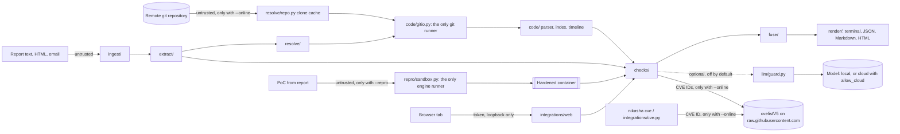

<!--
SPDX-FileCopyrightText: 2026 The Nikasha Authors
SPDX-License-Identifier: CC-BY-4.0
-->

# Threat model

Nikasha exists to handle hostile input. A vulnerability report can be crafted to attack
whatever reads it, a repository can carry git configuration or hooks, a stack trace can be
built to exhaust a parser, and a proof of concept is code that someone wants you to run.
This page describes where that input enters, what defends each boundary in the code today,
and what is left over.

## Data flow

Trust boundaries: the report, the repository contents, the proof of concept, model output,
and any HTTP request to the local web UI are all untrusted. The user's own configuration
file is trusted only for the options it may set (see [Configuration](configuration.md)).

## STRIDE

| Threat | Where | Mitigation in the code |
|---|---|---|
| **Spoofing**: another page in the browser calls the local web UI, or a hostname is rebound to `127.0.0.1` | `integrations/web` | Bound to `127.0.0.1` only, on a random port. A per-run `secrets.token_urlsafe(32)` token is required on every request. The `Host` header must be `127.0.0.1:<port>` or `localhost:<port>`. `Referrer-Policy: no-referrer`. `tests/security/test_web_hardening.py`. |
| **Tampering**: a repository's `.git/config`, hooks, attributes, textconv or external diff run code during a check | `code/gitio.py` | Git runs only through `run_git`, with an allowlist of plumbing subcommands (no `checkout`, `archive` or other porcelain), `--no-ext-diff` and `--no-textconv` on `log` and `show`, hardened `-c` options, and revisions from reports passed through `safe_rev` after `--end-of-options`. Trees are materialized with `GitRepo.export_tree`, never `git archive` (ADR 0006). `tests/security/test_git_hazards.py` plants 20 canary hooks. |
| **Tampering**: path traversal from report-supplied paths or archive members | `ingest/`, `code/`, `repro/` | Paths are looked up in git trees, never joined onto the host filesystem. Sandbox mounts are validated before the container starts. |
| **Repudiation**: a verdict nobody can trace back | `model/evidence.py`, `fuse/` | Every piece of evidence records the repository, ref, commit, path, lines and the command with hashes of its output. JSON output is byte-identical for identical inputs. `--explain` prints the full log-odds ledger. |
| **Information disclosure**: an embargoed report leaves the machine | everywhere | Offline unless `--online`, and `--online` allows only cloning or fetching the repository plus CVE record lookups (C15 and `nikasha cve`) from the CVE Program's `cvelistV5` on `raw.githubusercontent.com`. No telemetry. Cloud models are refused unless `llm.allow_cloud = true` is set in a configuration file. The cache directory is created with mode `0700`. |
| **Information disclosure / tampering**: script injection through report text in the HTML or Markdown output | `render/` | Everything taken from the input is escaped, and nothing input-derived is marked safe. The HTML report has a Content-Security-Policy that pins its single inline script by hash and allows no network requests. |
| **Denial of service**: ReDoS, huge reports, pathological source files | `extract/`, `code/parser.py` | Every module-level regex must be linear-time (bounded or possessive quantifiers), and `tests/unit/extract/test_regex_linear.py` checks them automatically. Overlap checks use an interval index. `parse_file` caps file size, parse time and error-tree width and never raises. History searches have timeouts, and a timeout makes history "incomplete" instead of proving absence. |
| **Elevation of privilege**: a proof of concept escapes to the host | `repro/sandbox.py` | Proofs of concept run only with `--repro`, only inside a container, and never on the host. The run uses `--network none`, `--read-only` (plus `--read-only-tmpfs=false` on podman), `--cap-drop ALL`, no new privileges, user `65534:65534`, memory, process-count and CPU limits, `--pull never`, and a wall-clock timeout that kills the container. `tests/unit/test_process_boundary.py` checks that only `gitio` and `sandbox` spawn processes. |
| **Elevation of privilege**: prompt injection through the report or the code steers the optional model | `llm/guard.py` | Untrusted text goes between neutralized delimiters. Answers must match a strict schema, and every cited line and quote must exist in the excerpt the model was shown. Strength is capped at 0.5, below every verdict threshold, so the model is never decisive. The prompt and response hashes are recorded. |

## Residual risks

- A container escape through a kernel or engine bug is outside what flags can prevent.
  Rootless podman, or an optional gVisor runtime, reduces the impact.
- On rootless cgroup v1 the engine cannot enforce memory or process limits. `doctor`
  reports this, and the result records whether the limits were enforced.
- The local web UI trusts anything that can read the printed URL, including its token, such
  as another local user who can see the terminal or the process list.
- In online mode, the CVE IDs a report cites are disclosed to GitHub when their records
  are fetched, which can reveal what an embargoed report is about.
- A cloud model, once enabled, receives excerpts of the report and the code. That is the
  user's explicit choice.
- Dependencies (tree-sitter grammars, pydantic, Jinja2) parse hostile input, and their bugs
  are Nikasha's attack surface.

## Known limitations

- **GROUNDED does not mean valid.** Someone who has read the real code can pass the static
  checks. That is why REPRODUCED exists.
- The call graph is name-based and approximate. Indirect calls, function pointers and
  dynamic dispatch are missed or over-approximated.
- Macro-heavy code lowers precision. C and C++ files with body-level `#if` blocks may parse
  only partially, and absence is then never treated as certain.
- Without tags there is no version inference. A report on an untagged commit or a
  distribution-patched build may resolve to INSUFFICIENT.
- Forks, vendored copies and generated files are harder cases. Generated and release-only
  files are never judged, and a fork may carry code that upstream never had.
