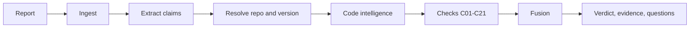

<!--
SPDX-FileCopyrightText: 2026 The Nikasha Authors
SPDX-License-Identifier: CC-BY-4.0
-->

# Concepts

Nikasha's main job is **grounding**: showing which claims in a report the code supports,
at the version the report names, with evidence for each. Its strongest evidence is
**reproduction** in the sandbox. Refutations are kept, gated and conservative, but they are
leads and questions for the reporter, not a fabrication detector: on the M3.5 curl corpus
they did not separate slop from genuine reports, while support did
([ADR 0012](adr/0012-reposition-after-m35.md)).

## Pipeline

## Claims

A **claim** is one statement in the report that can be checked: a file path, a symbol, a
line number, a quoted line or snippet, a stack trace, a patch, a version, a configuration
option, a commit, a CVE or CWE, or a CVSS vector. Claim IDs are derived from the claim's
content, so the same report always produces the same IDs.

Each claim has a **provenance**, which records whether it is about the project, the
reporter's own proof of concept, or a third-party library. It also has a **polarity**:
"the function does *not* check the length" is a negated claim. Only claims that are
attributed to the project and are not negated can ever be refuted. Nikasha still shows the
others, but they count for nothing.

## Evidence

Every check emits **evidence**. Each piece of evidence has a strength (a natural-log
likelihood ratio taken from `lr_defaults.yaml`), a group, and a locator: the repository,
ref, commit, path and lines, plus the exact command that produced it and hashes of its
output. The [Checks reference](checks.md) lists every check with its outcomes and strengths.

Missing code is not proof of fabrication. When a file or symbol is absent at the named
version, Nikasha first looks for it in other releases and in the history. Only something
that **never existed** anywhere counts as a strong refutation. If a history search times
out, the answer is "incomplete", never "fabricated".

## Scoring

Within each evidence group, findings are ranked by strength and weighted 1, 1/2, 1/4, and
so on. This way, ten correlated findings cannot outweigh a few independent ones. The damped
sum is the log-odds behind the **grounding score**, which runs from 0 to 100.

## Verdicts

The verdict comes from an ordered ladder, and the first rule that matches wins:

1. **REPRODUCED**: the proof of concept ran in the sandbox and produced the claimed crash
   signature. This needs `--repro` and a container engine.
2. **INSUFFICIENT**: there is no resolvable version, too few checkable claims, or too
   little evidence weight.
3. **UNGROUNDED**: the score is low *and* a core claim never existed in the history, and a
   second, independent group of evidence agrees.
4. **MIXED** (capped): the findings fit a different version from the one the report names.
5. **GROUNDED**: the score is high and nothing substantially refutes the claims.
6. Otherwise, **MIXED** or **INSUFFICIENT**.

UNGROUNDED is deliberately the hardest verdict to reach. The target is at most 1% false
UNGROUNDED verdicts on genuine reports. When in doubt, Nikasha says MIXED or INSUFFICIENT
and asks.

!!! warning "GROUNDED does not mean valid"
    Someone who has read the real code can pass the static checks. GROUNDED means the
    claims match the code, not that the bug exists. That is why REPRODUCED exists.

## Questions for the reporter

Each refutation or gap becomes a neutral question, for example: "Which release did you
test? `foo()` exists in 1.2.0 but not in 1.3.0, the version the report names." Projects can
reword these questions in [`nikasha.toml`](configuration.md).

## Reproduction

With `--repro`, Nikasha builds and runs a proof of concept only inside a hardened
container. The container has no network, a read-only root filesystem and every capability
dropped. It cannot gain new privileges, runs as an unprivileged user, and has memory,
process and time limits. The proof of concept never runs on the host. See [Sandbox](sandbox.md).

## Optional LLM

An advisory check (C20) can ask a model whether an excerpt of code supports a claim. The
model is local by default, or a cloud model if you give explicit consent. The check's
strength is capped below every verdict threshold, so it can shift a score but can never
decide a verdict. See [LLM](llm.md).

## Integrations

- [GitHub Action](action.md)
- [MCP server](mcp.md)
- [Local web UI](web-ui.md)
- [Configuration](configuration.md)
